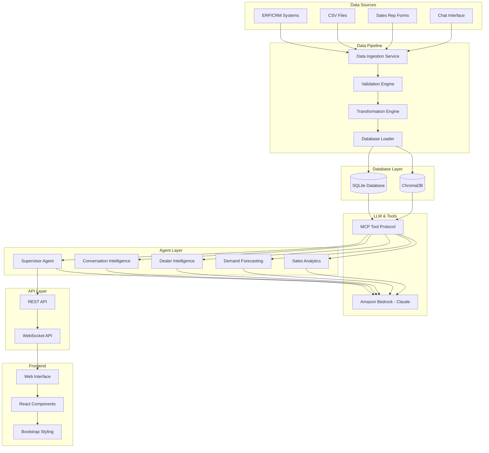

# Design Document

## Overview

The Retail Supply Chain Copilot is a sophisticated multi-agent AI system that transforms how product companies manage their dealer networks. The system captures sales conversations, extracts commitments automatically, and combines them with historical data to provide accurate demand forecasting and dealer intelligence.

The system includes a data ingestion pipeline that processes both structured data (purchase orders, invoices, delivery records, payments) and unstructured data (conversation notes). Multiple specialized AI agents work together to provide comprehensive sales and supply chain insights. The platform can be extended to serve dealers and distributors directly with inventory and reorder recommendations.

The architecture follows a microservices pattern with clear separation between data processing, agent orchestration, and specialized intelligence capabilities. The system is designed to handle high-volume data ingestion while providing real-time query responses through an intelligent agent routing system.

## Architecture

### High-Level Architecture



### Technology Stack

**Backend Services:**
- **Language**: Python 3.11+ for primary development
- **API Framework**: FastAPI for REST and WebSocket endpoints with automatic OpenAPI documentation
- **Database**: SQLite for structured data storage (orders, invoices, dealers, etc.)
- **Agent Framework**: LangGraph for multi-agent orchestration and workflow management
- **Tool Protocol**: MCP (Model Context Protocol) for standardized tool interfaces

**AI/ML Components:**
- **LLM Provider**: Amazon Bedrock (Claude) as core language model for all agents
- **Agent Orchestration**: LangGraph for managing agent workflows and state
- **Tool Integration**: MCP protocol for agents to query data and execute functions
- **Vector Storage**: ChromaDB for semantic search and embedding storage

**Frontend:**
- **UI Framework**: React.js with JavaScript for dynamic user interfaces
- **Styling**: CSS with Bootstrap for responsive design and components
- **Markup**: HTML5 for semantic structure
- **Real-time**: WebSocket integration for live chat interface

**Cloud Infrastructure (AWS):**
- **AI Services**: Amazon Bedrock for Claude model access
- **Database**: Amazon RDS (if scaling beyond SQLite)
- **Compute**: AWS Lambda for serverless functions
- **API Gateway**: AWS API Gateway for managed API endpoints
- **Security**: AWS IAM for access control and authentication

## Components and Interfaces

### Data Pipeline Components

#### Data Ingestion Service
```python
from typing import List, Dict, Any
from pydantic import BaseModel
from enum import Enum

class DataSource(str, Enum):
    ERP = "erp"
    CSV = "csv"
    FORMS = "forms"
    CHAT = "chat"

class IngestionResult(BaseModel):
    records_processed: int
    records_succeeded: int
    records_failed: int
    errors: List[Dict[str, Any]]
    processing_time_ms: int

class DataIngestionService:
    async def ingest_structured_data(
        self, source: DataSource, data: List[Dict[str, Any]]
    ) -> IngestionResult:
        """Ingest structured data from various sources"""
        pass
    
    async def ingest_unstructured_data(
        self, source: DataSource, data: List[str]
    ) -> IngestionResult:
        """Ingest unstructured conversation data"""
        pass
    
    def validate_data_format(
        self, data: Any, schema: Dict[str, Any]
    ) -> Dict[str, Any]:
        """Validate data against schema"""
        pass
```

#### Transformation Engine
```python
from typing import Dict, Any, List
from datetime import datetime

class EnrichedRecord(BaseModel):
    """Enhanced record with calculated fields"""
    raw_data: Dict[str, Any]
    days_since_last_order: int
    overdue_amount: float
    commitment_fulfillment_rate: float
    seasonality_factor: float

class TransformationEngine:
    def calculate_derived_fields(self, record: Dict[str, Any]) -> EnrichedRecord:
        """Calculate derived business metrics"""
        pass
    
    def standardize_formats(self, data: List[Dict[str, Any]]) -> List[Dict[str, Any]]:
        """Standardize data formats across sources"""
        pass
    
    def deduplicate_records(self, records: List[Dict[str, Any]]) -> List[Dict[str, Any]]:
        """Remove duplicate records"""
        pass
```

### Vector Store Components

#### ChromaDB Configuration
```python
import chromadb
from chromadb.config import Settings
from typing import List, Dict, Any

class VectorStoreConfig:
    """ChromaDB configuration for semantic search"""
    
    def __init__(self, persist_directory: str = "./chroma_db"):
        self.client = chromadb.Client(Settings(
            chroma_db_impl="duckdb+parquet",
            persist_directory=persist_directory
        ))
    
    def get_or_create_collection(self, name: str):
        """Get or create a ChromaDB collection"""
        return self.client.get_or_create_collection(
            name=name,
            metadata={"hnsw:space": "cosine"}
        )

class VectorCollections:
    """Collection names for different data types"""
    CONVERSATION_EMBEDDINGS = "conversation_embeddings"
    COMMITMENT_EMBEDDINGS = "commitment_embeddings"
    PRODUCT_EMBEDDINGS = "product_embeddings"
```

### Agent System Components

#### Supervisor Agent
```python
from langgraph import StateGraph, END
from typing import Dict, Any, List
from enum import Enum

class AgentType(str, Enum):
    CONVERSATION_INTELLIGENCE = "conversation_intelligence"
    DEALER_INTELLIGENCE = "dealer_intelligence"
    DEMAND_FORECASTING = "demand_forecasting"
    SALES_ANALYTICS = "sales_analytics"

class QueryIntent(BaseModel):
    primary_agent: AgentType
    secondary_agents: List[AgentType]
    data_requirements: List[str]
    response_format: str

class SupervisorAgent:
    def __init__(self, bedrock_client, mcp_tools):
        self.bedrock_client = bedrock_client
        self.mcp_tools = mcp_tools
        self.workflow = self._build_workflow()
    
    async def classify_intent(self, query: str) -> QueryIntent:
        """Use Claude to classify user intent"""
        pass
    
    async def route_query(self, intent: QueryIntent, query: str) -> Dict[str, Any]:
        """Route query to appropriate agents using LangGraph"""
        pass
    
    async def combine_responses(self, responses: List[Dict[str, Any]]) -> Dict[str, Any]:
        """Combine responses from multiple agents into coherent output"""
        pass
    
    def _build_workflow(self) -> StateGraph:
        """Build LangGraph workflow for agent orchestration"""
        workflow = StateGraph(dict)
        workflow.add_node("classify", self.classify_intent)
        workflow.add_node("route", self.route_query)
        workflow.add_node("combine", self.combine_responses)
        return workflow
```

#### Conversation Intelligence Agent
```python
from typing import List, Dict, Any
import json

class Commitment(BaseModel):
    product_id: str
    quantity: int
    timeframe: str
    confidence: float
    extracted_text: str

class Issue(BaseModel):
    category: str
    description: str
    severity: str
    confidence: float

class ConversationIntelligenceAgent:
    def __init__(self, bedrock_client, mcp_tools, vector_store: VectorStoreConfig):
        self.bedrock_client = bedrock_client
        self.mcp_tools = mcp_tools
        self.vector_store = vector_store
        self.conversations_collection = vector_store.get_or_create_collection(
            VectorCollections.CONVERSATION_EMBEDDINGS
        )
    
    async def extract_commitments(self, conversation_text: str) -> List[Commitment]:
        """Extract commitments using Claude with structured output"""
        prompt = f"""
        Extract commitments from this sales conversation:
        {conversation_text}
        
        Return JSON with commitments including product, quantity, timeframe, and confidence.
        """
        response = await self.bedrock_client.invoke_model(
            modelId="anthropic.claude-3-sonnet-20240229-v1:0",
            body=json.dumps({"messages": [{"role": "user", "content": prompt}]})
        )
        return self._parse_commitments(response)
    
    async def extract_issues(self, conversation_text: str) -> List[Issue]:
        """Extract dealer issues and complaints"""
        pass
    
    async def extract_product_interests(self, conversation_text: str) -> List[Dict[str, Any]]:
        """Extract product interests mentioned in conversation"""
        pass
    
    async def store_conversation_embedding(
        self, visit_id: str, conversation_text: str, metadata: Dict[str, Any]
    ) -> None:
        """Store conversation embedding in ChromaDB for semantic search"""
        self.conversations_collection.add(
            documents=[conversation_text],
            metadatas=[metadata],
            ids=[visit_id]
        )
    
    async def search_similar_conversations(
        self, query: str, n_results: int = 5
    ) -> List[Dict[str, Any]]:
        """Search for similar past conversations using semantic search"""
        results = self.conversations_collection.query(
            query_texts=[query],
            n_results=n_results
        )
        return results
    
    async def save_extracted_data(
        self, dealer_id: str, visit_id: str, data: Dict[str, Any]
    ) -> None:
        """Save extracted data using MCP tools"""
        await self.mcp_tools.call("save_conversation_data", {
            "dealer_id": dealer_id,
            "visit_id": visit_id,
            "data": data
        })
```

#### Dealer Intelligence Agent
```python
class DealerProfile(BaseModel):
    id: str
    name: str
    address: Dict[str, str]
    credit_limit: float
    payment_terms: int
    status: str

class DealerIntelligenceAgent:
    def __init__(self, bedrock_client, mcp_tools):
        self.bedrock_client = bedrock_client
        self.mcp_tools = mcp_tools
    
    async def get_dealer_profile(self, dealer_id: str) -> DealerProfile:
        """Get dealer profile using MCP database tools"""
        profile_data = await self.mcp_tools.call("get_dealer_by_id", {
            "dealer_id": dealer_id
        })
        return DealerProfile(**profile_data)
    
    async def get_payment_status(self, dealer_id: str) -> Dict[str, Any]:
        """Get current payment status and outstanding amounts"""
        return await self.mcp_tools.call("get_dealer_payment_status", {
            "dealer_id": dealer_id
        })
    
    async def get_order_history(self, dealer_id: str, limit: int = 10) -> List[Dict[str, Any]]:
        """Get recent order history for dealer"""
        return await self.mcp_tools.call("get_dealer_orders", {
            "dealer_id": dealer_id,
            "limit": limit
        })
    
    async def get_commitment_history(self, dealer_id: str) -> Dict[str, Any]:
        """Get commitment history and fulfillment rates"""
        return await self.mcp_tools.call("get_dealer_commitments", {
            "dealer_id": dealer_id
        })
    
    async def get_territory_summary(self, territory_id: str) -> Dict[str, Any]:
        """Aggregate dealer metrics by territory"""
        return await self.mcp_tools.call("get_territory_metrics", {
            "territory_id": territory_id
        })
    
    async def get_at_risk_dealers(self, territory_id: str) -> List[Dict[str, Any]]:
        """Identify dealers with declining orders, overdue payments, or missed commitments"""
        return await self.mcp_tools.call("get_at_risk_dealers", {
            "territory_id": territory_id
        })
    
    async def generate_dealer_briefing(self, dealer_id: str) -> str:
        """Generate comprehensive dealer briefing using Claude"""
        profile = await self.get_dealer_profile(dealer_id)
        payment_status = await self.get_payment_status(dealer_id)
        order_history = await self.get_order_history(dealer_id)
        commitment_history = await self.get_commitment_history(dealer_id)
        
        prompt = f"""
        Generate a comprehensive dealer briefing for:
        Profile: {profile.dict()}
        Payment Status: {payment_status}
        Recent Orders: {order_history}
        Commitment History: {commitment_history}
        
        Include key insights and recommendations for the sales visit.
        """
        
        response = await self.bedrock_client.invoke_model(
            modelId="anthropic.claude-3-sonnet-20240229-v1:0",
            body=json.dumps({"messages": [{"role": "user", "content": prompt}]})
        )
        return response
```

#### Demand Forecasting Agent
```python
from datetime import datetime, timedelta
from typing import List, Dict, Any

class ForecastResult(BaseModel):
    predictions: List[Dict[str, Any]]
    confidence_score: float
    seasonality_factors: List[float]
    commitment_impact: float
    data_gaps: List[str]

class DemandForecastingAgent:
    def __init__(self, bedrock_client, mcp_tools):
        self.bedrock_client = bedrock_client
        self.mcp_tools = mcp_tools
    
    async def get_historical_demand(self, filters: Dict[str, Any]) -> List[Dict[str, Any]]:
        """Get historical sales data using MCP tools"""
        return await self.mcp_tools.call("get_historical_sales", filters)
    
    async def get_active_commitments(self, filters: Dict[str, Any]) -> List[Dict[str, Any]]:
        """Get unfulfilled commitments"""
        return await self.mcp_tools.call("get_active_commitments", filters)
    
    async def get_seasonal_patterns(self, product_id: str, territory_id: str) -> Dict[str, Any]:
        """Analyze historical seasonality patterns"""
        return await self.mcp_tools.call("get_seasonal_patterns", {
            "product_id": product_id,
            "territory_id": territory_id
        })
    
    async def calculate_forecast(
        self, 
        historical: List[Dict[str, Any]], 
        commitments: List[Dict[str, Any]],
        seasonality: Dict[str, Any]
    ) -> ForecastResult:
        """Calculate demand forecast using Claude for analysis"""
        prompt = f"""
        Analyze this historical sales data and active commitments to generate a demand forecast:
        
        Historical Data: {historical}
        Active Commitments: {commitments}
        Seasonality Patterns: {seasonality}
        
        Provide forecast with:
        1. Predictions by product and period
        2. Confidence scores based on dealer commitment fulfillment history
        3. Seasonality analysis
        4. Impact of commitments on forecast
        5. Any data gaps that affect accuracy
        """
        
        response = await self.bedrock_client.invoke_model(
            modelId="anthropic.claude-3-sonnet-20240229-v1:0",
            body=json.dumps({"messages": [{"role": "user", "content": prompt}]})
        )
        return self._parse_forecast_response(response)
    
    async def compare_periods(
        self, current_forecast: ForecastResult, comparison_period: str
    ) -> Dict[str, Any]:
        """Compare forecast against previous periods"""
        return await self.mcp_tools.call("compare_forecast_periods", {
            "current": current_forecast.dict(),
            "comparison_period": comparison_period
        })
```

#### Sales Analytics Agent
```python
class PerformanceMetrics(BaseModel):
    sales_rep_id: str
    period: Dict[str, str]
    visit_count: int
    dealers_covered: int
    commitments_secured: int
    commitments_fulfilled: int
    conversion_rate: float
    total_sales_value: float
    collections_achieved: float

class SalesAnalyticsAgent:
    def __init__(self, bedrock_client, mcp_tools):
        self.bedrock_client = bedrock_client
        self.mcp_tools = mcp_tools
    
    async def get_visit_coverage(
        self, territory_id: str, time_range: Dict[str, str]
    ) -> Dict[str, Any]:
        """Calculate visit coverage metrics"""
        return await self.mcp_tools.call("get_visit_coverage", {
            "territory_id": territory_id,
            "time_range": time_range
        })
    
    async def get_commitment_conversion(
        self, sales_rep_id: str, time_range: Dict[str, str]
    ) -> Dict[str, Any]:
        """Calculate commitment to order conversion rates"""
        commitments = await self.mcp_tools.call("get_rep_commitments", {
            "sales_rep_id": sales_rep_id,
            "time_range": time_range
        })
        orders = await self.mcp_tools.call("get_rep_orders", {
            "sales_rep_id": sales_rep_id,
            "time_range": time_range
        })
        
        prompt = f"""
        Analyze commitment conversion for sales rep:
        Commitments: {commitments}
        Actual Orders: {orders}
        
        Calculate conversion rate and identify patterns.
        """
        
        response = await self.bedrock_client.invoke_model(
            modelId="anthropic.claude-3-sonnet-20240229-v1:0",
            body=json.dumps({"messages": [{"role": "user", "content": prompt}]})
        )
        return self._parse_conversion_analysis(response)
    
    async def get_follow_up_list(
        self, sales_rep_id: str
    ) -> List[Dict[str, Any]]:
        """Generate list of dealers needing follow-up based on commitments"""
        return await self.mcp_tools.call("get_pending_follow_ups", {
            "sales_rep_id": sales_rep_id
        })
    
    async def get_sales_rep_performance(
        self, sales_rep_id: str, time_range: Dict[str, str]
    ) -> PerformanceMetrics:
        """Get comprehensive performance metrics for sales rep"""
        return await self.mcp_tools.call("get_rep_performance", {
            "sales_rep_id": sales_rep_id,
            "time_range": time_range
        })
    
    async def get_territory_ranking(
        self, time_range: Dict[str, str]
    ) -> List[Dict[str, Any]]:
        """Rank territories by key performance metrics"""
        return await self.mcp_tools.call("get_territory_rankings", {
            "time_range": time_range
        })
    
    async def get_period_comparison(
        self, entity_id: str, entity_type: str, periods: List[Dict[str, str]]
    ) -> Dict[str, Any]:
        """Calculate trends and period-over-period comparisons"""
        return await self.mcp_tools.call("get_period_comparison", {
            "entity_id": entity_id,
            "entity_type": entity_type,
            "periods": periods
        })
```

## Data Models

### Core Business Entities (SQLite Schema)

#### Dealer Model
```python
from sqlalchemy import Column, Integer, String, Float, DateTime, Text, ForeignKey
from sqlalchemy.ext.declarative import declarative_base
from sqlalchemy.orm import relationship
from datetime import datetime

Base = declarative_base()

class Dealer(Base):
    __tablename__ = "dealers"
    
    id = Column(String, primary_key=True)
    name = Column(String, nullable=False)
    code = Column(String, unique=True, nullable=False)
    street = Column(String)
    city = Column(String)
    state = Column(String)
    postal_code = Column(String)
    country = Column(String)
    phone = Column(String)
    email = Column(String)
    credit_limit = Column(Float, default=0.0)
    payment_terms = Column(Integer, default=30)
    territory_id = Column(String, ForeignKey("territories.id"))
    status = Column(String, default="active")
    created_at = Column(DateTime, default=datetime.utcnow)
    updated_at = Column(DateTime, default=datetime.utcnow, onupdate=datetime.utcnow)
    
    # Relationships
    territory = relationship("Territory", back_populates="dealers")
    orders = relationship("PurchaseOrder", back_populates="dealer")
    visits = relationship("Visit", back_populates="dealer")

class Territory(Base):
    __tablename__ = "territories"
    
    id = Column(String, primary_key=True)
    name = Column(String, nullable=False)
    region = Column(String)
    sales_rep_id = Column(String, ForeignKey("sales_reps.id"))
    
    # Relationships
    dealers = relationship("Dealer", back_populates="territory")
    sales_rep = relationship("SalesRep", back_populates="territories")
```

#### Order and Transaction Models
```python
class PurchaseOrder(Base):
    __tablename__ = "purchase_orders"
    
    id = Column(String, primary_key=True)
    order_number = Column(String, unique=True, nullable=False)
    dealer_id = Column(String, ForeignKey("dealers.id"), nullable=False)
    sales_rep_id = Column(String, ForeignKey("sales_reps.id"))
    order_date = Column(DateTime, nullable=False)
    expected_delivery_date = Column(DateTime)
    status = Column(String, default="pending")
    total_amount = Column(Float, default=0.0)
    created_at = Column(DateTime, default=datetime.utcnow)
    updated_at = Column(DateTime, default=datetime.utcnow, onupdate=datetime.utcnow)
    
    # Relationships
    dealer = relationship("Dealer", back_populates="orders")
    sales_rep = relationship("SalesRep", back_populates="orders")
    line_items = relationship("OrderLineItem", back_populates="order")
    invoices = relationship("Invoice", back_populates="order")
    deliveries = relationship("DeliveryRecord", back_populates="order")

class OrderLineItem(Base):
    __tablename__ = "order_line_items"
    
    id = Column(String, primary_key=True)
    order_id = Column(String, ForeignKey("purchase_orders.id"), nullable=False)
    product_id = Column(String, ForeignKey("products.id"), nullable=False)
    quantity = Column(Integer, nullable=False)
    unit_price = Column(Float, nullable=False)
    line_total = Column(Float, nullable=False)
    delivery_status = Column(String, default="pending")
    
    # Relationships
    order = relationship("PurchaseOrder", back_populates="line_items")
    product = relationship("Product")

class Invoice(Base):
    __tablename__ = "invoices"
    
    id = Column(String, primary_key=True)
    invoice_number = Column(String, unique=True, nullable=False)
    order_id = Column(String, ForeignKey("purchase_orders.id"))
    dealer_id = Column(String, ForeignKey("dealers.id"), nullable=False)
    invoice_date = Column(DateTime, nullable=False)
    due_date = Column(DateTime, nullable=False)
    total_amount = Column(Float, nullable=False)
    paid_amount = Column(Float, default=0.0)
    outstanding_amount = Column(Float, nullable=False)
    status = Column(String, default="pending")
    
    # Relationships
    order = relationship("PurchaseOrder", back_populates="invoices")
    dealer = relationship("Dealer")
    payments = relationship("Payment", back_populates="invoice")

class Payment(Base):
    __tablename__ = "payments"
    
    id = Column(String, primary_key=True)
    payment_number = Column(String, unique=True)
    invoice_id = Column(String, ForeignKey("invoices.id"), nullable=False)
    dealer_id = Column(String, ForeignKey("dealers.id"), nullable=False)
    amount = Column(Float, nullable=False)
    payment_date = Column(DateTime, nullable=False)
    payment_method = Column(String)
    reference_number = Column(String)
    
    # Relationships
    invoice = relationship("Invoice", back_populates="payments")
    dealer = relationship("Dealer")

class DeliveryRecord(Base):
    __tablename__ = "delivery_records"
    
    id = Column(String, primary_key=True)
    order_id = Column(String, ForeignKey("purchase_orders.id"), nullable=False)
    dispatch_date = Column(DateTime)
    expected_delivery_date = Column(DateTime)
    actual_delivery_date = Column(DateTime)
    status = Column(String, default="pending")
    tracking_number = Column(String)
    notes = Column(Text)
    
    # Relationships
    order = relationship("PurchaseOrder", back_populates="deliveries")

class CreditNote(Base):
    __tablename__ = "credit_notes"
    
    id = Column(String, primary_key=True)
    credit_note_number = Column(String, unique=True, nullable=False)
    invoice_id = Column(String, ForeignKey("invoices.id"), nullable=False)
    dealer_id = Column(String, ForeignKey("dealers.id"), nullable=False)
    amount = Column(Float, nullable=False)
    reason = Column(String)
    issue_date = Column(DateTime, nullable=False)
    status = Column(String, default="pending")
    
    # Relationships
    invoice = relationship("Invoice")
    dealer = relationship("Dealer")
```

#### Conversation and Commitment Models
```python
class Visit(Base):
    __tablename__ = "visits"
    
    id = Column(String, primary_key=True)
    dealer_id = Column(String, ForeignKey("dealers.id"), nullable=False)
    sales_rep_id = Column(String, ForeignKey("sales_reps.id"), nullable=False)
    visit_date = Column(DateTime, nullable=False)
    purpose = Column(String)
    outcome = Column(String)
    next_actions = Column(Text)  # JSON array of next actions
    conversation_notes = Column(Text)
    extraction_confidence = Column(Float)
    extracted_at = Column(DateTime)
    created_at = Column(DateTime, default=datetime.utcnow)
    
    # Relationships
    dealer = relationship("Dealer", back_populates="visits")
    sales_rep = relationship("SalesRep", back_populates="visits")
    commitments = relationship("Commitment", back_populates="visit")
    issues = relationship("Issue", back_populates="visit")

class Commitment(Base):
    __tablename__ = "commitments"
    
    id = Column(String, primary_key=True)
    visit_id = Column(String, ForeignKey("visits.id"), nullable=False)
    dealer_id = Column(String, ForeignKey("dealers.id"), nullable=False)
    product_id = Column(String, ForeignKey("products.id"))
    quantity = Column(Integer, nullable=False)
    timeframe = Column(String, nullable=False)
    status = Column(String, default="pending")
    fulfillment_date = Column(DateTime)
    actual_quantity = Column(Integer)
    confidence = Column(Float, nullable=False)
    extracted_text = Column(Text)
    created_at = Column(DateTime, default=datetime.utcnow)
    
    # Relationships
    visit = relationship("Visit", back_populates="commitments")
    dealer = relationship("Dealer")
    product = relationship("Product")

class Issue(Base):
    __tablename__ = "issues"
    
    id = Column(String, primary_key=True)
    visit_id = Column(String, ForeignKey("visits.id"), nullable=False)
    dealer_id = Column(String, ForeignKey("dealers.id"), nullable=False)
    category = Column(String, nullable=False)
    description = Column(Text, nullable=False)
    severity = Column(String, default="medium")
    status = Column(String, default="open")
    confidence = Column(Float, nullable=False)
    resolution_notes = Column(Text)
    resolved_at = Column(DateTime)
    created_at = Column(DateTime, default=datetime.utcnow)
    
    # Relationships
    visit = relationship("Visit", back_populates="issues")
    dealer = relationship("Dealer")

class Product(Base):
    __tablename__ = "products"
    
    id = Column(String, primary_key=True)
    name = Column(String, nullable=False)
    code = Column(String, unique=True, nullable=False)
    category = Column(String)
    price = Column(Float)
    description = Column(Text)
    status = Column(String, default="active")
    created_at = Column(DateTime, default=datetime.utcnow)

class SalesRep(Base):
    __tablename__ = "sales_reps"
    
    id = Column(String, primary_key=True)
    name = Column(String, nullable=False)
    email = Column(String, unique=True, nullable=False)
    phone = Column(String)
    employee_id = Column(String, unique=True)
    status = Column(String, default="active")
    created_at = Column(DateTime, default=datetime.utcnow)
    
    # Relationships
    territories = relationship("Territory", back_populates="sales_rep")
    orders = relationship("PurchaseOrder", back_populates="sales_rep")
    visits = relationship("Visit", back_populates="sales_rep")
```

### Analytics and Forecasting Models

#### Forecast Models
```python
class DemandForecast(Base):
    __tablename__ = "demand_forecasts"
    
    id = Column(String, primary_key=True)
    product_id = Column(String, ForeignKey("products.id"))
    territory_id = Column(String, ForeignKey("territories.id"))
    forecast_period_start = Column(DateTime, nullable=False)
    forecast_period_end = Column(DateTime, nullable=False)
    methodology = Column(String, nullable=False)
    confidence_score = Column(Float, nullable=False)
    predictions_json = Column(Text)  # JSON array of predictions
    seasonality_factors_json = Column(Text)  # JSON array of factors
    commitment_impact = Column(Float, default=0.0)
    created_at = Column(DateTime, default=datetime.utcnow)
    
    # Relationships
    product = relationship("Product")
    territory = relationship("Territory")

class SalesRepMetrics(Base):
    __tablename__ = "sales_rep_metrics"
    
    id = Column(String, primary_key=True)
    sales_rep_id = Column(String, ForeignKey("sales_reps.id"), nullable=False)
    period_start = Column(DateTime, nullable=False)
    period_end = Column(DateTime, nullable=False)
    visit_count = Column(Integer, default=0)
    dealers_covered = Column(Integer, default=0)
    commitments_secured = Column(Integer, default=0)
    commitments_fulfilled = Column(Integer, default=0)
    conversion_rate = Column(Float, default=0.0)
    total_sales_value = Column(Float, default=0.0)
    collections_achieved = Column(Float, default=0.0)
    created_at = Column(DateTime, default=datetime.utcnow)
    
    # Relationships
    sales_rep = relationship("SalesRep")
```

## Correctness Properties

*A property is a characteristic or behavior that should hold true across all valid executions of a system-essentially, a formal statement about what the system should do. Properties serve as the bridge between human-readable specifications and machine-verifiable correctness guarantees.*

### Conversation Intelligence Properties

**Property 1: Commitment extraction completeness**
*For any* conversation text containing commitment language (quantities, timeframes, product mentions), the Conversation Intelligence Agent should extract all commitment information with appropriate confidence scores
**Validates: Requirements 1.1**

**Property 2: Issue identification accuracy**
*For any* conversation text containing complaint or concern language, the Conversation Intelligence Agent should identify and categorize all issues mentioned
**Validates: Requirements 1.2**

**Property 3: Product interest extraction**
*For any* conversation text mentioning products or categories, the Conversation Intelligence Agent should extract and properly categorize all product interests
**Validates: Requirements 1.3**

**Property 4: Extracted data persistence**
*For any* successfully extracted conversation data, the system should store it with correct dealer and visit associations that can be retrieved later
**Validates: Requirements 1.4**

**Property 5: Invalid input rejection**
*For any* invalid or incomplete conversation data, the system should reject the input and provide clear, actionable error messages
**Validates: Requirements 1.5**

### Data Pipeline Properties

**Property 6: Comprehensive data validation**
*For any* data file from ERP/CRM systems, the Data Pipeline should validate all required fields and formats, rejecting invalid data with specific error messages
**Validates: Requirements 2.1, 7.1**

**Property 7: Partial processing with error handling**
*For any* dataset containing mixed valid and invalid records, the Data Pipeline should process all valid records while flagging invalid ones with specific errors
**Validates: Requirements 2.2, 7.2**

**Property 8: Data standardization and deduplication**
*For any* raw dataset with varying formats and duplicates, the Data Pipeline should standardize formats and remove duplicates while preserving unique records
**Validates: Requirements 2.3**

**Property 9: Derived field calculation accuracy**
*For any* order and payment data, the Data Pipeline should correctly calculate derived fields like days since last order and overdue amounts
**Validates: Requirements 2.4**

**Property 10: Transactional data linking**
*For any* related business documents (orders, invoices, payments, credit notes), the Data Pipeline should correctly establish and maintain relationships between them
**Validates: Requirements 2.6, 2.7, 2.8, 2.9, 2.10**

### Agent Orchestration Properties

**Property 11: Query routing accuracy**
*For any* user query, the Supervisor Agent should correctly classify intent and route to appropriate specialized agents based on query content
**Validates: Requirements 3.1, 6.1, 6.2**

**Property 12: Response combination coherence**
*For any* set of responses from multiple agents, the Supervisor Agent should combine them into a single, coherent, and comprehensive answer
**Validates: Requirements 3.5, 6.4**

**Property 13: Multi-agent coordination**
*For any* query requiring multiple data sources, the Supervisor Agent should coordinate requests across appropriate agents and merge results effectively
**Validates: Requirements 6.3**

**Property 14: Error handling and suggestions**
*For any* unclear or unprocessable query, the Supervisor Agent should provide helpful error messages and suggest alternative phrasings
**Validates: Requirements 6.5**

### Dealer Intelligence Properties

**Property 15: Comprehensive dealer data retrieval**
*For any* dealer briefing request, the Dealer Intelligence Agent should retrieve complete profile information, payment status, order history, and commitment data
**Validates: Requirements 3.2, 3.3, 3.4, 3.6**

**Property 16: Territory aggregation accuracy**
*For any* territory, the Dealer Intelligence Agent should correctly aggregate dealer metrics including active dealers, total business, and outstanding amounts
**Validates: Requirements 8.1**

**Property 17: At-risk dealer identification**
*For any* dealer with declining orders, overdue payments, or missed commitments, the system should correctly identify them as at-risk
**Validates: Requirements 8.3**

### Demand Forecasting Properties

**Property 18: Historical data integration**
*For any* forecast request, the Demand Forecasting Agent should retrieve and incorporate relevant historical sales data filtered by product, region, and time period
**Validates: Requirements 4.1**

**Property 19: Commitment-enhanced forecasting**
*For any* forecast calculation, the system should incorporate active unfulfilled commitments and adjust confidence scores based on dealer fulfillment history
**Validates: Requirements 4.2, 4.3**

**Property 20: Seasonality factor integration**
*For any* historical data with seasonal patterns, the Demand Forecasting Agent should detect and incorporate seasonality factors into predictions
**Validates: Requirements 4.6**

**Property 21: Forecast comparison accuracy**
*For any* comparative analysis request, the system should correctly calculate and present forecast comparisons against previous periods
**Validates: Requirements 4.4**

**Property 22: Incomplete data handling**
*For any* forecast request with incomplete data, the system should identify data gaps and provide partial forecasts with appropriate disclaimers
**Validates: Requirements 4.5**

### Sales Analytics Properties

**Property 23: Performance metrics calculation**
*For any* sales representative or territory, the Sales Analytics Agent should correctly calculate visit coverage, commitment conversion, and collection metrics
**Validates: Requirements 5.1, 5.2, 5.4, 5.6, 8.2**

**Property 24: Follow-up list generation**
*For any* set of commitments and dealer interactions, the system should correctly identify dealers requiring follow-up based on commitment status and timelines
**Validates: Requirements 5.3**

**Property 25: Trend analysis accuracy**
*For any* performance data spanning multiple periods, the system should correctly calculate trends and period-over-period comparisons
**Validates: Requirements 5.5, 8.5**

**Property 26: Territory ranking logic**
*For any* set of territories with performance data, the system should correctly rank them by key performance metrics
**Validates: Requirements 8.4**

### System Resilience Properties

**Property 27: Graceful error handling**
*For any* database error or system component failure, the system should handle exceptions gracefully while maintaining available functionality
**Validates: Requirements 7.3, 7.4**

**Property 28: Data inconsistency management**
*For any* detected data inconsistencies, the system should flag issues for administrator review while preserving normal system operation
**Validates: Requirements 7.5**

## Error Handling

### Data Pipeline Error Handling

**Validation Errors:**
- Field-level validation with specific error messages
- Schema validation for structured data
- Format validation for dates, numbers, and text fields
- Referential integrity checks for linked records

**Processing Errors:**
- Graceful handling of malformed data files
- Partial processing with detailed error reporting
- Automatic retry mechanisms for transient failures
- Dead letter queues for persistently failing records

**Data Quality Issues:**
- Duplicate detection and resolution strategies
- Missing data imputation where appropriate
- Outlier detection and flagging
- Data consistency checks across related entities

### Agent System Error Handling

**Query Processing Errors:**
- Intent classification confidence thresholds
- Fallback mechanisms for unclear queries
- Timeout handling for long-running agent operations
- Circuit breaker patterns for failing agents

**Data Access Errors:**
- Database connection pooling and retry logic
- Cache invalidation and refresh strategies
- Partial result handling when some data sources fail
- Graceful degradation of functionality

**Integration Errors:**
- API rate limiting and backoff strategies
- External service timeout handling
- Data transformation error recovery
- Message queue failure handling

### User Experience Error Handling

**Input Validation:**
- Real-time validation feedback
- Clear error messages with suggested corrections
- Progressive disclosure of validation rules
- Contextual help for complex inputs

**System Feedback:**
- Loading states for long-running operations
- Progress indicators for data processing
- Clear success and failure notifications
- Detailed error logs for troubleshooting

## Testing Strategy

### Dual Testing Approach

The system requires both unit testing and property-based testing to ensure comprehensive coverage:

**Unit Tests:**
- Verify specific examples and edge cases
- Test integration points between components
- Validate error conditions and boundary cases
- Ensure proper handling of known scenarios

**Property-Based Tests:**
- Verify universal properties across all valid inputs
- Test system behavior with randomly generated data
- Validate correctness properties defined in this document
- Ensure robustness across the entire input space

### Property-Based Testing Framework

**Technology Choice:** We will use **Hypothesis** for Python property-based testing, which provides:
- Comprehensive random data generation with strategies
- Shrinking capabilities for minimal failing examples
- Integration with pytest testing framework
- Support for complex data structures and custom generators

**Testing Configuration:**
- Each property-based test will run a minimum of **100 iterations**
- Tests will use smart generators that constrain to valid input spaces
- Each test will be tagged with comments referencing the specific correctness property
- Test tags will follow the format: **Feature: retail-supply-chain-copilot, Property {number}: {property_text}**

**Property Test Implementation:**
```python
from hypothesis import given, strategies as st
import pytest

# Example property-based test
@given(
    conversation_text=st.text(min_size=10, max_size=1000),
    commitments=st.lists(
        st.builds(
            dict,
            product=st.text(min_size=1, max_size=50),
            quantity=st.integers(min_value=1, max_value=10000),
            timeframe=st.sampled_from(["next week", "next month", "Q1", "Q2"])
        ),
        min_size=1,
        max_size=5
    )
)
async def test_commitment_extraction_completeness(conversation_text, commitments):
    """
    Feature: retail-supply-chain-copilot, Property 1: Commitment extraction completeness
    For any conversation text containing commitment language, the agent should extract 
    all commitment information with appropriate confidence scores
    """
    # Test implementation
    agent = ConversationIntelligenceAgent(bedrock_client, mcp_tools, vector_store)
    extracted = await agent.extract_commitments(conversation_text)
    
    # Verify all commitments are extracted with confidence scores
    assert all(c.confidence > 0.0 for c in extracted)
    assert len(extracted) >= 0  # Should handle empty cases gracefully
```

- Each correctness property will be implemented by a single property-based test
- Tests will focus on core logic without excessive mocking
- Generators will create realistic test data that reflects actual business scenarios
- Tests will validate both positive cases and error conditions

### Unit Testing Strategy

**Component Testing:**
- Data Pipeline components: validation, transformation, and loading logic using pytest
- Agent implementations: query processing, data retrieval, and response formatting
- Database operations: SQLAlchemy ORM operations, complex queries, and transaction handling
- FastAPI endpoints: request/response handling, authentication, and error cases
- ChromaDB operations: embedding storage, retrieval, and similarity search

**Integration Testing:**
- Agent orchestration workflows using LangGraph
- Data pipeline end-to-end processing with SQLite
- Database schema and relationship integrity
- Amazon Bedrock integration and MCP tool integration
- ChromaDB semantic search integration

**Frontend Testing:**
- React component testing using Jest and React Testing Library
- WebSocket connection handling and real-time updates
- Bootstrap styling and responsive design validation
- User interaction flows and form validation

**Test Organization:**
- Co-locate tests with source files using `_test.py` suffix
- Group related tests in test classes
- Use descriptive test names that explain the scenario being tested
- Maintain test data fixtures for consistent testing scenarios using pytest fixtures

### Testing Requirements

**Coverage Requirements:**
- All correctness properties must have corresponding property-based tests
- Critical business logic must have both unit and property tests
- Error handling paths must be thoroughly tested
- Integration points must have dedicated test coverage

**Quality Gates:**
- All tests must pass before code deployment
- Property-based tests must not reveal any failing examples
- Code coverage must meet minimum thresholds (80% line coverage)
- Performance tests must validate response time requirements