# Design Document

## Overview

The SupplyChain Copilot is a multi-agent AI system designed specifically for Indian MSMEs in B2B distribution. Unlike enterprise solutions requiring complex ERP implementations, this system works through Telegram—a familiar interface that requires no training—to capture field intelligence and provide actionable insights.

The core innovation is **commitment-aware intelligence**: the system extracts dealer commitments from natural language sales conversations (e.g., "Sharma ji will order 500 units next Tuesday") and combines them with historical transactional data to provide visibility into the sales pipeline that MSMEs currently lack. The system tracks commitment fulfillment using **forecast consumption logic** similar to enterprise ERP systems, enabling managers to see which commitments converted to actual orders.

The architecture follows a multi-agent pattern using **AWS Bedrock Multi-Agent Collaboration** for orchestration, with specialized agents handling different aspects of sales intelligence. The system is designed for accessibility: it works on basic smartphones, handles Hinglish input, and requires minimal data entry from field staff.

## Architecture

### High-Level Architecture


### Agent Interaction Flow

```mermaid
sequenceDiagram
    participant User as Sales Rep (Telegram)
    participant Webhook as Telegram Webhook
    participant Sup as Supervisor Agent
    participant VC as Visit Capture Agent
    participant DI as Dealer Intelligence Agent
    participant OP as Order Planning Agent
    participant Lambda as Lambda Functions
    participant DB as SQLite
    participant LLM as AWS Bedrock (Claude)
    
    Note over User,LLM: Flow 1: Log Visit with Commitment
    User->>Webhook: "Met Sharma Distributors, collected 45K, will order 50 cases next week"
    Webhook->>Sup: Process message
    Sup->>LLM: Classify intent
    LLM-->>Sup: Intent: VISIT_LOG
    Sup->>VC: Handle visit capture
    VC->>Lambda: resolve_entity("Sharma Distributors")
    Lambda->>DB: Fuzzy match dealer name
    DB-->>Lambda: dealer_id: 1042, confidence: 0.92
    VC->>LLM: Extract structured data from notes
    LLM-->>VC: {dealer, payment: 45000, commitment: {qty: 50, timeframe: "next week"}}
    VC->>Webhook: Confirm extraction with user
    Webhook->>User: "✓ Sharma Distributors | ₹45K collected | 50 cases next week. Save?"
    User->>Webhook: [✓ Save]
    VC->>Lambda: create_visit_record(...)
    VC->>Lambda: create_commitment(...)
    Lambda->>DB: INSERT visit, commitment
    Webhook->>User: "Visit saved! 🎉"
    
    Note over User,LLM: Flow 2: Order Placed - Commitment Consumption
    User->>Webhook: "Sharma ji placed order for 50 cases"
    Webhook->>Sup: Process message
    Sup->>LLM: Classify intent
    LLM-->>Sup: Intent: ORDER_CAPTURE
    Sup->>OP: Handle order with commitment matching
    OP->>Lambda: get_pending_commitments("Sharma Distributors")
    Lambda->>DB: SELECT pending commitments
    DB-->>Lambda: [{commitment_id: 101, qty: 50, expected_date: "next week"}]
    OP->>Lambda: check_inventory(product_id, qty: 50)
    Lambda->>DB: SELECT available stock
    DB-->>Lambda: {available: 75, reserved: 10}
    OP->>Lambda: consume_commitment(commitment_id: 101, order_qty: 50)
    Lambda->>DB: UPDATE commitment SET status='fulfilled'
    OP->>Lambda: create_order(...)
    Lambda->>DB: INSERT order
    Webhook->>User: "✅ Order created | Commitment fulfilled | Stock available"
```



### Technology Stack

**Backend Services:**
- **Language**: Python 3.11+
- **Agent Framework**: AWS Bedrock Multi-Agent Collaboration
- **Tool Interface**: Lambda Action Groups (OpenAPI schema + Lambda functions)
- **Database**: SQLite for structured data storage (sufficient for MSME scale)
- **Bot Framework**: python-telegram-bot with AWS Lambda webhook

**AI Components:**
- **LLM Provider**: AWS Bedrock (Claude Sonnet) for all agent intelligence
- **Agent Orchestration**: AWS Bedrock Supervisor-Collaborator pattern
- **Entity Resolution**: Fuzzy matching using rapidfuzz library (in Lambda)
- **Intent Classification**: LLM-based classification via Supervisor Agent

**Frontend:**
- **Sales Rep Interface**: Telegram Bot with inline keyboards
- **Manager Dashboard**: React.js with Bootstrap/Tailwind CSS

**Cloud Infrastructure (AWS):**
- **AI Services**: Amazon Bedrock for Claude model access and agent orchestration
- **Compute**: AWS Lambda for action groups and webhook handling
- **API**: AWS API Gateway for REST endpoints
- **Storage**: Amazon S3 for static assets and SQLite database file
- **Frontend Hosting**: AWS Amplify for React dashboard
- **Monitoring**: Amazon CloudWatch for logs and metrics

## Components and Interfaces

### Telegram Bot Component (Lambda Webhook)

```python
import json
import boto3
from telegram import Update, InlineKeyboardButton, InlineKeyboardMarkup
from telegram.ext import Application

# Initialize Bedrock Agent client
bedrock_agent_runtime = boto3.client('bedrock-agent-runtime')

AGENT_ID = "your-supervisor-agent-id"
AGENT_ALIAS_ID = "your-agent-alias-id"

def lambda_handler(event, context):
    """Lambda handler for Telegram webhook."""
    body = json.loads(event['body'])
    update = Update.de_json(body, None)
    
    if update.message:
        return handle_message(update.message)
    elif update.callback_query:
        return handle_callback(update.callback_query)
    
    return {'statusCode': 200}

def handle_message(message):
    """Process incoming message through Bedrock Agent."""
    user_id = str(message.from_user.id)
    text = message.text
    
    # Check for commands
    if text == '/start':
        return send_main_menu(message.chat.id)
    
    # Send to Bedrock Supervisor Agent
    response = bedrock_agent_runtime.invoke_agent(
        agentId=AGENT_ID,
        agentAliasId=AGENT_ALIAS_ID,
        sessionId=user_id,
        inputText=text
    )
    
    # Process streaming response
    agent_response = process_agent_response(response)
    
    # Send response back to Telegram
    return send_telegram_message(message.chat.id, agent_response)

def send_main_menu(chat_id):
    """Display main menu with primary actions."""
    keyboard = [
        [
            InlineKeyboardButton("📝 Log Visit", callback_data="log_visit"),
            InlineKeyboardButton("📅 Plan Day", callback_data="plan_day")
        ],
        [
            InlineKeyboardButton("📊 Dashboard", callback_data="dashboard"),
            InlineKeyboardButton("❓ Help", callback_data="help")
        ]
    ]
    reply_markup = InlineKeyboardMarkup(keyboard)
    
    text = (
        "🙏 *Welcome to SupplyChain Copilot*\n\n"
        "Choose an action or type your query:\n\n"
        "💬 Examples:\n"
        "• _Brief me for Sharma Distributors_\n"
        "• _Met Gupta Traders, collected 45K_\n"
        "• _Aaj kisko visit karun?_"
    )
    
    return send_telegram_message(chat_id, text, reply_markup)
```

### AWS Bedrock Agent Configuration

#### Supervisor Agent Instructions

```
You are the Supervisor Agent for SupplyChain Copilot, an AI assistant for Indian MSME sales operations.

Your role is to:
1. Understand user intent from natural language queries (English, Hindi, or Hinglish)
2. Route requests to the appropriate specialized agent
3. Combine responses from multiple agents when needed
4. Provide helpful responses when no specialized agent is needed

Available Collaborator Agents:
- Visit_Capture_Agent: Handles logging of dealer visits, extracting commitments, payments
- Dealer_Intelligence_Agent: Provides dealer briefings, payment status, health scores, visit planning
- Order_Planning_Agent: Handles order processing, commitment fulfillment, inventory checks

Intent Classification:
- VISIT_LOG: User is describing a dealer visit they completed
- DEALER_INQUIRY: User wants information about a dealer
- PAYMENT_STATUS: User asks specifically about payments
- VISIT_PLAN: User wants recommendations for which dealers to visit
- DASHBOARD: User wants to see their performance metrics
- ORDER_CAPTURE: User is recording or discussing an order
- COMMITMENT_STATUS: User asks about commitment fulfillment
- GENERAL: General question or conversation

Handle Hinglish naturally:
- "Sharma ji ka payment status" → PAYMENT_STATUS
- "Aaj kisko visit karun?" → VISIT_PLAN
- "Met Gupta Traders, 50K collect kiya" → VISIT_LOG
```

#### Visit Capture Agent Instructions

```
You are the Visit Capture Agent for SupplyChain Copilot.

Your role is to extract structured information from natural language visit notes.

When processing visit notes, extract:
1. Dealer name (fuzzy match against database)
2. Payment collected (amount and method if mentioned)
3. Commitments (product, quantity, timeframe)
4. Issues or complaints raised
5. Follow-up actions needed
6. Competitor information mentioned

Always confirm extracted data with the user before saving.

Handle various input formats:
- "Met Sharma Distributors, collected 45K, will order 50 cases next week"
- "Gupta Traders visit done. 30K cash liya. Complaint about delivery delay."
- "Visited Metro - they'll order Product-A 100 units by Tuesday"

Use the following action groups:
- resolve_entity: Match dealer/product names
- create_visit_record: Save visit to database
- create_commitment: Save commitment to database
```

#### Dealer Intelligence Agent Instructions

```
You are the Dealer Intelligence Agent for SupplyChain Copilot.

Your role is to provide comprehensive dealer information and analytics.

Capabilities:
1. Dealer Briefing: Profile, payment status, order history, pending commitments, health score
2. Visit Planning: Prioritized list of dealers based on urgency factors
3. Performance Dashboard: Sales metrics, collection progress, visit coverage
4. At-Risk Alerts: Identify dealers needing attention

When providing briefings, highlight:
- Overdue payments prominently
- Approaching commitment deadlines
- Health score with reasons if below 70
- Suggested talking points

For visit planning, prioritize by:
- Payment overdue amount and days
- Days since last order
- Pending commitments about to expire
- Dealer health score
- Days since last visit

Use the following action groups:
- get_dealer_profile: Basic dealer information
- get_payment_status: Outstanding and overdue amounts
- get_order_history: Recent orders
- get_dealer_health_score: Calculated health metrics
- suggest_visit_plan: Prioritized dealer list
- get_rep_metrics: Sales rep performance data
```

#### Order Planning Agent Instructions

```
You are the Order Planning Agent for SupplyChain Copilot.

Your role is to handle order processing and commitment fulfillment tracking.

Capabilities:
1. Order Capture: Record new orders
2. Commitment Matching: Match orders against pending commitments (forecast consumption)
3. Inventory Check: Verify available-to-promise (ATP) quantity
4. Fulfillment Status: Track commitment conversion rates

Forecast Consumption Logic:
- When an order is placed, first try to match against pending commitments
- Use backward consumption: Match against past (overdue) commitments first
- Then use forward consumption: Match against future commitments
- Update commitment status: pending → partial → fulfilled
- Track missed commitments when due date passes without order

Available-to-Promise (ATP) Check:
- Check current inventory
- Subtract reserved/committed quantities
- If insufficient, suggest alternatives or order splitting

Manager Alerts:
- Generate alerts for at-risk dealers
- Route discount approval requests above threshold
- Flag missed commitments for review

Use the following action groups:
- get_pending_commitments: Unfulfilled commitments for dealer
- consume_commitment: Match order against commitment
- check_inventory: Verify ATP quantity
- create_order: Record new order
- generate_alert: Create manager alert
```

### Lambda Action Groups

#### Dealer Action Group (Lambda Function)

```python
import json
import sqlite3
from rapidfuzz import fuzz, process
from datetime import datetime, timedelta

DB_PATH = '/tmp/supplychain.db'

def lambda_handler(event, context):
    """Handle Dealer Action Group requests from Bedrock Agent."""
    
    action = event['actionGroup']
    function = event['function']
    parameters = {p['name']: p['value'] for p in event.get('parameters', [])}
    
    if function == 'get_dealer_profile':
        result = get_dealer_profile(parameters['dealer_id'])
    elif function == 'get_payment_status':
        result = get_payment_status(parameters['dealer_id'])
    elif function == 'get_order_history':
        result = get_order_history(
            parameters['dealer_id'],
            int(parameters.get('limit', 5))
        )
    elif function == 'get_dealer_health_score':
        result = get_dealer_health_score(parameters['dealer_id'])
    elif function == 'resolve_entity':
        result = resolve_entity(
            parameters['entity_type'],
            parameters['entity_name'],
            parameters.get('user_id')
        )
    else:
        result = {'error': f'Unknown function: {function}'}
    
    return {
        'messageVersion': '1.0',
        'response': {
            'actionGroup': action,
            'function': function,
            'functionResponse': {
                'responseBody': {
                    'TEXT': {'body': json.dumps(result)}
                }
            }
        }
    }

def get_dealer_profile(dealer_id):
    """Get dealer profile information."""
    conn = sqlite3.connect(DB_PATH)
    conn.row_factory = sqlite3.Row
    cursor = conn.cursor()
    
    cursor.execute("""
        SELECT d.*, t.name as territory_name, s.name as sales_rep_name
        FROM dealers d
        LEFT JOIN territories t ON d.territory_id = t.id
        LEFT JOIN sales_persons s ON d.sales_rep_id = s.id
        WHERE d.id = ?
    """, (dealer_id,))
    
    row = cursor.fetchone()
    conn.close()
    
    if row:
        return dict(row)
    return {'error': 'Dealer not found'}

def get_payment_status(dealer_id):
    """Get dealer payment status including outstanding and overdue amounts."""
    conn = sqlite3.connect(DB_PATH)
    cursor = conn.cursor()
    
    # Get total outstanding
    cursor.execute("""
        SELECT 
            COALESCE(SUM(i.total_amount - COALESCE(p.paid_amount, 0)), 0) as outstanding_amount,
            COALESCE(SUM(CASE 
                WHEN i.due_date < date('now') 
                THEN i.total_amount - COALESCE(p.paid_amount, 0) 
                ELSE 0 
            END), 0) as overdue_amount,
            MAX(CASE 
                WHEN i.due_date < date('now') 
                THEN julianday('now') - julianday(i.due_date)
                ELSE 0
            END) as days_overdue
        FROM invoices i
        LEFT JOIN (
            SELECT invoice_id, SUM(amount) as paid_amount
            FROM payments
            GROUP BY invoice_id
        ) p ON i.id = p.invoice_id
        WHERE i.dealer_id = ? AND i.status != 'paid'
    """, (dealer_id,))
    
    row = cursor.fetchone()
    conn.close()
    
    return {
        'dealer_id': dealer_id,
        'outstanding_amount': row[0] or 0,
        'overdue_amount': row[1] or 0,
        'days_overdue': int(row[2] or 0)
    }

def get_dealer_health_score(dealer_id):
    """Calculate dealer health score based on multiple factors."""
    conn = sqlite3.connect(DB_PATH)
    cursor = conn.cursor()
    
    # Get order recency and frequency
    cursor.execute("""
        SELECT 
            MAX(order_date) as last_order_date,
            COUNT(*) as order_count,
            AVG(total_amount) as avg_order_value
        FROM orders
        WHERE dealer_id = ? AND order_date >= date('now', '-6 months')
    """, (dealer_id,))
    order_data = cursor.fetchone()
    
    # Get payment behavior
    cursor.execute("""
        SELECT 
            COUNT(CASE WHEN p.payment_date <= i.due_date THEN 1 END) as on_time_payments,
            COUNT(*) as total_invoices
        FROM invoices i
        LEFT JOIN payments p ON i.id = p.invoice_id
        WHERE i.dealer_id = ? AND i.invoice_date >= date('now', '-6 months')
    """, (dealer_id,))
    payment_data = cursor.fetchone()
    
    # Get commitment fulfillment
    cursor.execute("""
        SELECT 
            COUNT(CASE WHEN status = 'fulfilled' THEN 1 END) as fulfilled,
            COUNT(*) as total
        FROM commitments
        WHERE dealer_id = ? AND created_at >= date('now', '-6 months')
    """, (dealer_id,))
    commitment_data = cursor.fetchone()
    
    conn.close()
    
    # Calculate component scores
    scores = {}
    reasons = []
    
    # Recency score (25%)
    if order_data[0]:
        days_since_order = (datetime.now() - datetime.strptime(order_data[0], '%Y-%m-%d')).days
        recency_score = max(0, 100 - (days_since_order * 2))
        if days_since_order > 30:
            reasons.append(f"No order in {days_since_order} days")
    else:
        recency_score = 0
        reasons.append("No recent orders")
    scores['recency'] = recency_score * 0.25
    
    # Frequency score (25%)
    expected_orders = 6  # Expected orders in 6 months
    frequency_score = min(100, (order_data[1] or 0) / expected_orders * 100)
    if order_data[1] < 3:
        reasons.append("Low order frequency")
    scores['frequency'] = frequency_score * 0.25
    
    # Payment score (25%)
    if payment_data[1] > 0:
        payment_score = (payment_data[0] / payment_data[1]) * 100
        if payment_score < 70:
            reasons.append("Payment delays")
    else:
        payment_score = 50  # Neutral if no data
    scores['payment'] = payment_score * 0.25
    
    # Commitment fulfillment score (25%)
    if commitment_data[1] > 0:
        fulfillment_score = (commitment_data[0] / commitment_data[1]) * 100
        if fulfillment_score < 70:
            reasons.append("Low commitment conversion")
    else:
        fulfillment_score = 50  # Neutral if no data
    scores['fulfillment'] = fulfillment_score * 0.25
    
    total_score = sum(scores.values())
    
    # Determine status
    if total_score >= 70:
        status = 'healthy'
    elif total_score >= 50:
        status = 'at_risk'
    else:
        status = 'critical'
    
    return {
        'dealer_id': dealer_id,
        'score': round(total_score),
        'status': status,
        'components': scores,
        'reasons': reasons[:3] if status != 'healthy' else []
    }

def resolve_entity(entity_type, entity_name, user_id=None):
    """Resolve fuzzy entity name to ID using fuzzy matching."""
    conn = sqlite3.connect(DB_PATH)
    conn.row_factory = sqlite3.Row
    cursor = conn.cursor()
    
    if entity_type == 'dealer':
        if user_id:
            cursor.execute("""
                SELECT id, name FROM dealers 
                WHERE sales_rep_id = (
                    SELECT id FROM sales_persons WHERE telegram_id = ?
                )
            """, (user_id,))
        else:
            cursor.execute("SELECT id, name FROM dealers")
        
        entities = {row['id']: row['name'] for row in cursor.fetchall()}
    elif entity_type == 'product':
        cursor.execute("SELECT id, name FROM products")
        entities = {row['id']: row['name'] for row in cursor.fetchall()}
    else:
        conn.close()
        return {'error': f'Unknown entity type: {entity_type}'}
    
    conn.close()
    
    if not entities:
        return {'confidence': 0, 'candidates': []}
    
    matches = process.extract(
        entity_name,
        entities,
        scorer=fuzz.token_sort_ratio,
        limit=3
    )
    
    if matches and matches[0][1] >= 70:
        best_match = matches[0]
        return {
            'entity_id': best_match[2],
            'entity_name': best_match[0],
            'confidence': best_match[1] / 100,
            'candidates': [
                {'id': m[2], 'name': m[0], 'score': m[1]} 
                for m in matches
            ]
        }
    
    return {
        'confidence': 0,
        'candidates': [
            {'id': m[2], 'name': m[0], 'score': m[1]} 
            for m in matches
        ]
    }
```

#### Order Action Group (Lambda Function)

```python
import json
import sqlite3
from datetime import datetime, timedelta

DB_PATH = '/tmp/supplychain.db'

def lambda_handler(event, context):
    """Handle Order Action Group requests from Bedrock Agent."""
    
    function = event['function']
    parameters = {p['name']: p['value'] for p in event.get('parameters', [])}
    
    if function == 'get_pending_commitments':
        result = get_pending_commitments(parameters['dealer_id'])
    elif function == 'consume_commitment':
        result = consume_commitment(
            parameters['commitment_id'],
            int(parameters['order_quantity'])
        )
    elif function == 'check_inventory':
        result = check_inventory(
            parameters['product_id'],
            int(parameters['quantity'])
        )
    elif function == 'create_order':
        result = create_order(parameters)
    elif function == 'get_forecast_consumption':
        result = get_forecast_consumption(parameters.get('days', 30))
    elif function == 'generate_alert':
        result = generate_alert(parameters)
    else:
        result = {'error': f'Unknown function: {function}'}
    
    return format_response(event['actionGroup'], function, result)

def get_pending_commitments(dealer_id):
    """Get unfulfilled commitments for a dealer."""
    conn = sqlite3.connect(DB_PATH)
    conn.row_factory = sqlite3.Row
    cursor = conn.cursor()
    
    cursor.execute("""
        SELECT c.*, p.name as product_name
        FROM commitments c
        LEFT JOIN products p ON c.product_id = p.id
        WHERE c.dealer_id = ? AND c.status IN ('pending', 'partial')
        ORDER BY c.expected_date ASC
    """, (dealer_id,))
    
    commitments = [dict(row) for row in cursor.fetchall()]
    conn.close()
    
    return {'commitments': commitments}

def consume_commitment(commitment_id, order_quantity):
    """
    Match an order against a commitment using forecast consumption logic.
    
    Consumption Logic:
    1. Get the commitment
    2. Calculate consumed quantity
    3. Update commitment status (partial if remaining, fulfilled if complete)
    4. Return consumption result
    """
    conn = sqlite3.connect(DB_PATH)
    conn.row_factory = sqlite3.Row
    cursor = conn.cursor()
    
    # Get commitment
    cursor.execute("""
        SELECT * FROM commitments WHERE id = ?
    """, (commitment_id,))
    commitment = cursor.fetchone()
    
    if not commitment:
        conn.close()
        return {'error': 'Commitment not found'}
    
    remaining_qty = commitment['quantity_promised'] - commitment['quantity_consumed']
    consume_qty = min(order_quantity, remaining_qty)
    new_consumed = commitment['quantity_consumed'] + consume_qty
    
    # Update commitment
    if new_consumed >= commitment['quantity_promised']:
        new_status = 'fulfilled'
    else:
        new_status = 'partial'
    
    cursor.execute("""
        UPDATE commitments 
        SET quantity_consumed = ?, status = ?, updated_at = ?
        WHERE id = ?
    """, (new_consumed, new_status, datetime.now().isoformat(), commitment_id))
    
    conn.commit()
    conn.close()
    
    return {
        'commitment_id': commitment_id,
        'consumed_quantity': consume_qty,
        'remaining_quantity': commitment['quantity_promised'] - new_consumed,
        'status': new_status,
        'order_remaining': order_quantity - consume_qty
    }

def check_inventory(product_id, quantity):
    """
    Check available-to-promise (ATP) quantity.
    
    ATP = Current Stock - Reserved - Committed (pending orders)
    """
    conn = sqlite3.connect(DB_PATH)
    cursor = conn.cursor()
    
    # Get current stock
    cursor.execute("""
        SELECT COALESCE(SUM(quantity), 0) as current_stock
        FROM inventory WHERE product_id = ?
    """, (product_id,))
    current_stock = cursor.fetchone()[0]
    
    # Get reserved quantity (pending orders not yet shipped)
    cursor.execute("""
        SELECT COALESCE(SUM(oi.quantity), 0) as reserved
        FROM order_items oi
        JOIN orders o ON oi.order_id = o.id
        WHERE oi.product_id = ? AND o.status IN ('pending', 'confirmed')
    """, (product_id,))
    reserved = cursor.fetchone()[0]
    
    conn.close()
    
    available = current_stock - reserved
    can_fulfill = available >= quantity
    
    return {
        'product_id': product_id,
        'requested_quantity': quantity,
        'current_stock': current_stock,
        'reserved': reserved,
        'available_to_promise': available,
        'can_fulfill': can_fulfill,
        'shortfall': max(0, quantity - available) if not can_fulfill else 0
    }

def get_forecast_consumption(days=30):
    """
    Get forecast consumption summary showing commitments vs actual orders.
    
    This implements backward/forward consumption logic summary:
    - Shows commitments by period
    - Shows actual orders matched
    - Shows consumption rate
    """
    conn = sqlite3.connect(DB_PATH)
    conn.row_factory = sqlite3.Row
    cursor = conn.cursor()
    
    # Get commitments and their fulfillment
    cursor.execute("""
        SELECT 
            strftime('%Y-%W', c.expected_date) as period,
            SUM(c.quantity_promised) as committed_qty,
            SUM(c.quantity_consumed) as consumed_qty,
            COUNT(CASE WHEN c.status = 'fulfilled' THEN 1 END) as fulfilled_count,
            COUNT(CASE WHEN c.status = 'missed' THEN 1 END) as missed_count,
            COUNT(*) as total_commitments
        FROM commitments c
        WHERE c.expected_date >= date('now', '-' || ? || ' days')
          AND c.expected_date <= date('now', '+' || ? || ' days')
        GROUP BY period
        ORDER BY period
    """, (days, days))
    
    periods = [dict(row) for row in cursor.fetchall()]
    conn.close()
    
    # Calculate overall metrics
    total_committed = sum(p['committed_qty'] or 0 for p in periods)
    total_consumed = sum(p['consumed_qty'] or 0 for p in periods)
    
    return {
        'periods': periods,
        'summary': {
            'total_committed': total_committed,
            'total_consumed': total_consumed,
            'consumption_rate': round(total_consumed / total_committed * 100, 1) if total_committed > 0 else 0,
            'period_days': days
        }
    }

def generate_alert(params):
    """Generate manager alert for critical situations."""
    conn = sqlite3.connect(DB_PATH)
    cursor = conn.cursor()
    
    cursor.execute("""
        INSERT INTO alerts (alert_type, entity_type, entity_id, message, severity, status, created_at)
        VALUES (?, ?, ?, ?, ?, 'pending', ?)
    """, (
        params['alert_type'],
        params['entity_type'],
        params['entity_id'],
        params['message'],
        params.get('severity', 'medium'),
        datetime.now().isoformat()
    ))
    
    alert_id = cursor.lastrowid
    conn.commit()
    conn.close()
    
    return {'alert_id': alert_id, 'status': 'created'}

def format_response(action_group, function, result):
    """Format Lambda response for Bedrock Agent."""
    return {
        'messageVersion': '1.0',
        'response': {
            'actionGroup': action_group,
            'function': function,
            'functionResponse': {
                'responseBody': {
                    'TEXT': {'body': json.dumps(result)}
                }
            }
        }
    }
```

## Data Models

### Core Business Entities (SQLite Schema)

```sql
-- Dealer Master
CREATE TABLE dealers (
    id TEXT PRIMARY KEY,
    name TEXT NOT NULL,
    code TEXT UNIQUE NOT NULL,
    phone TEXT,
    email TEXT,
    contact_person TEXT,
    street TEXT,
    city TEXT,
    state TEXT,
    pincode TEXT,
    territory_id TEXT REFERENCES territories(id),
    sales_rep_id TEXT REFERENCES sales_persons(id),
    credit_limit REAL DEFAULT 100000,
    payment_terms INTEGER DEFAULT 30,
    status TEXT DEFAULT 'active',
    category TEXT DEFAULT 'B',
    created_at TIMESTAMP DEFAULT CURRENT_TIMESTAMP,
    updated_at TIMESTAMP DEFAULT CURRENT_TIMESTAMP
);

-- Products
CREATE TABLE products (
    id TEXT PRIMARY KEY,
    name TEXT NOT NULL,
    code TEXT UNIQUE NOT NULL,
    category TEXT,
    unit_price REAL NOT NULL,
    unit_of_measure TEXT DEFAULT 'units',
    status TEXT DEFAULT 'active',
    created_at TIMESTAMP DEFAULT CURRENT_TIMESTAMP
);

-- Inventory
CREATE TABLE inventory (
    id TEXT PRIMARY KEY,
    product_id TEXT REFERENCES products(id),
    location TEXT DEFAULT 'main_warehouse',
    quantity INTEGER DEFAULT 0,
    reserved_quantity INTEGER DEFAULT 0,
    updated_at TIMESTAMP DEFAULT CURRENT_TIMESTAMP
);

-- Orders
CREATE TABLE orders (
    id TEXT PRIMARY KEY,
    order_number TEXT UNIQUE NOT NULL,
    dealer_id TEXT REFERENCES dealers(id),
    sales_rep_id TEXT REFERENCES sales_persons(id),
    order_date DATE NOT NULL,
    status TEXT DEFAULT 'pending',
    total_amount REAL,
    discount_amount REAL DEFAULT 0,
    notes TEXT,
    source TEXT DEFAULT 'field_visit',
    created_at TIMESTAMP DEFAULT CURRENT_TIMESTAMP
);

-- Order Items
CREATE TABLE order_items (
    id TEXT PRIMARY KEY,
    order_id TEXT REFERENCES orders(id),
    product_id TEXT REFERENCES products(id),
    quantity INTEGER NOT NULL,
    unit_price REAL NOT NULL,
    discount_percent REAL DEFAULT 0,
    amount REAL NOT NULL
);

-- Invoices
CREATE TABLE invoices (
    id TEXT PRIMARY KEY,
    invoice_number TEXT UNIQUE NOT NULL,
    order_id TEXT REFERENCES orders(id),
    dealer_id TEXT REFERENCES dealers(id),
    invoice_date DATE NOT NULL,
    due_date DATE NOT NULL,
    total_amount REAL NOT NULL,
    status TEXT DEFAULT 'pending'
);

-- Payments
CREATE TABLE payments (
    id TEXT PRIMARY KEY,
    invoice_id TEXT REFERENCES invoices(id),
    dealer_id TEXT REFERENCES dealers(id),
    amount REAL NOT NULL,
    payment_date DATE NOT NULL,
    payment_method TEXT,
    collected_by TEXT REFERENCES sales_persons(id),
    notes TEXT,
    created_at TIMESTAMP DEFAULT CURRENT_TIMESTAMP
);

-- Visits
CREATE TABLE visits (
    id TEXT PRIMARY KEY,
    dealer_id TEXT REFERENCES dealers(id),
    sales_rep_id TEXT REFERENCES sales_persons(id),
    visit_date DATE NOT NULL,
    visit_type TEXT DEFAULT 'planned',
    purpose TEXT,
    outcome TEXT,
    conversation_notes TEXT,
    payment_collected REAL,
    payment_method TEXT,
    created_at TIMESTAMP DEFAULT CURRENT_TIMESTAMP
);

-- Commitments
CREATE TABLE commitments (
    id TEXT PRIMARY KEY,
    visit_id TEXT REFERENCES visits(id),
    dealer_id TEXT REFERENCES dealers(id),
    product_id TEXT REFERENCES products(id),
    quantity_promised INTEGER NOT NULL,
    quantity_consumed INTEGER DEFAULT 0,
    expected_date DATE,
    status TEXT DEFAULT 'pending',
    confidence REAL DEFAULT 0.8,
    created_at TIMESTAMP DEFAULT CURRENT_TIMESTAMP,
    updated_at TIMESTAMP DEFAULT CURRENT_TIMESTAMP
);

-- Alerts
CREATE TABLE alerts (
    id INTEGER PRIMARY KEY AUTOINCREMENT,
    alert_type TEXT NOT NULL,
    entity_type TEXT NOT NULL,
    entity_id TEXT NOT NULL,
    message TEXT NOT NULL,
    severity TEXT DEFAULT 'medium',
    status TEXT DEFAULT 'pending',
    assigned_to TEXT REFERENCES sales_persons(id),
    resolved_by TEXT,
    resolved_at TIMESTAMP,
    created_at TIMESTAMP DEFAULT CURRENT_TIMESTAMP
);

-- Sales Persons
CREATE TABLE sales_persons (
    id TEXT PRIMARY KEY,
    name TEXT NOT NULL,
    phone TEXT,
    email TEXT,
    telegram_id TEXT UNIQUE,
    role TEXT DEFAULT 'sales_rep',
    manager_id TEXT REFERENCES sales_persons(id),
    territory_id TEXT REFERENCES territories(id),
    status TEXT DEFAULT 'active',
    created_at TIMESTAMP DEFAULT CURRENT_TIMESTAMP
);

-- Territories
CREATE TABLE territories (
    id TEXT PRIMARY KEY,
    name TEXT NOT NULL,
    region TEXT,
    state TEXT,
    status TEXT DEFAULT 'active'
);

-- Sales Targets
CREATE TABLE sales_targets (
    id TEXT PRIMARY KEY,
    sales_rep_id TEXT REFERENCES sales_persons(id),
    period_start DATE NOT NULL,
    period_end DATE NOT NULL,
    sales_target REAL NOT NULL,
    collection_target REAL NOT NULL,
    visit_target INTEGER
);

-- Entity Aliases (for fuzzy matching)
CREATE TABLE entity_aliases (
    id INTEGER PRIMARY KEY AUTOINCREMENT,
    entity_type TEXT NOT NULL,
    entity_id TEXT NOT NULL,
    alias TEXT NOT NULL,
    UNIQUE(entity_type, entity_id, alias)
);

-- Indexes for performance
CREATE INDEX idx_dealers_territory ON dealers(territory_id);
CREATE INDEX idx_dealers_sales_rep ON dealers(sales_rep_id);
CREATE INDEX idx_orders_dealer ON orders(dealer_id);
CREATE INDEX idx_orders_date ON orders(order_date);
CREATE INDEX idx_commitments_dealer ON commitments(dealer_id);
CREATE INDEX idx_commitments_status ON commitments(status);
CREATE INDEX idx_commitments_expected ON commitments(expected_date);
CREATE INDEX idx_visits_dealer ON visits(dealer_id);
CREATE INDEX idx_payments_dealer ON payments(dealer_id);
CREATE INDEX idx_alerts_status ON alerts(status);
```

## Algorithms

### Dealer Health Score Calculation

```python
def calculate_health_score(dealer_id: str) -> Dict[str, Any]:
    """
    Calculate dealer health score using weighted factors.
    
    Components (each 25%):
    1. Order Recency: Days since last order
    2. Order Frequency: Order count vs expected
    3. Payment Behavior: On-time payment rate
    4. Commitment Fulfillment: Conversion rate
    
    Returns score 0-100 with status and reasons.
    """
    # Recency Score (25%)
    days_since_order = get_days_since_last_order(dealer_id)
    recency_score = max(0, 100 - (days_since_order * 2))  # -2 points per day
    
    # Frequency Score (25%)
    orders_last_6_months = get_order_count(dealer_id, months=6)
    expected_orders = 6  # 1 per month average
    frequency_score = min(100, (orders_last_6_months / expected_orders) * 100)
    
    # Payment Score (25%)
    on_time_rate = get_on_time_payment_rate(dealer_id)
    payment_score = on_time_rate * 100
    
    # Fulfillment Score (25%)
    fulfillment_rate = get_commitment_fulfillment_rate(dealer_id)
    fulfillment_score = fulfillment_rate * 100
    
    # Weighted total
    total_score = (
        recency_score * 0.25 +
        frequency_score * 0.25 +
        payment_score * 0.25 +
        fulfillment_score * 0.25
    )
    
    # Determine status
    if total_score >= 70:
        status = "healthy"
    elif total_score >= 50:
        status = "at_risk"
    else:
        status = "critical"
    
    return {
        "score": round(total_score),
        "status": status,
        "components": {
            "recency": round(recency_score),
            "frequency": round(frequency_score),
            "payment": round(payment_score),
            "fulfillment": round(fulfillment_score)
        }
    }
```

### Forecast Consumption Algorithm

```python
def consume_forecast(dealer_id: str, product_id: str, order_qty: int) -> Dict[str, Any]:
    """
    Match an order against commitments using backward/forward consumption.
    
    Logic:
    1. Get all pending commitments for dealer/product
    2. Sort by expected_date (oldest first for backward consumption)
    3. Consume oldest commitments first (backward consumption)
    4. If backward exhausted, consume future commitments (forward consumption)
    5. Return consumption summary
    
    Consumption Windows:
    - Backward: Unlimited (consume all past due first)
    - Forward: 7 days (only consume near-term future commitments)
    """
    remaining_qty = order_qty
    consumed = []
    
    # Get pending commitments sorted by date
    commitments = get_pending_commitments(
        dealer_id, 
        product_id,
        order_by='expected_date ASC'
    )
    
    today = datetime.now().date()
    forward_limit = today + timedelta(days=7)
    
    for commitment in commitments:
        if remaining_qty <= 0:
            break
        
        expected_date = commitment['expected_date']
        
        # Backward consumption (past due)
        if expected_date <= today:
            consume_qty = min(remaining_qty, commitment['remaining_qty'])
            update_commitment(commitment['id'], consume_qty)
            consumed.append({
                'commitment_id': commitment['id'],
                'consumed': consume_qty,
                'type': 'backward'
            })
            remaining_qty -= consume_qty
        
        # Forward consumption (within window)
        elif expected_date <= forward_limit:
            consume_qty = min(remaining_qty, commitment['remaining_qty'])
            update_commitment(commitment['id'], consume_qty)
            consumed.append({
                'commitment_id': commitment['id'],
                'consumed': consume_qty,
                'type': 'forward'
            })
            remaining_qty -= consume_qty
    
    return {
        'order_qty': order_qty,
        'consumed_from_commitments': order_qty - remaining_qty,
        'unmatched_qty': remaining_qty,
        'consumption_details': consumed
    }
```

### Visit Priority Score Calculation

```python
def calculate_visit_priority(dealer_id: str) -> Dict[str, Any]:
    """
    Calculate dealer visit priority score using weighted urgency factors.
    
    Factors and Weights:
    - Payment Urgency (30%): Based on overdue amount and days
    - Order Urgency (25%): Days since last order
    - Visit Recency (15%): Days since last visit
    - Commitment Score (15%): Pending commitments about to expire
    - Relationship Risk (15%): Based on health score
    
    Returns priority score, level, and recommended action.
    """
    # Payment Urgency (30%)
    payment_status = get_payment_status(dealer_id)
    if payment_status['overdue_amount'] > 0:
        payment_urgency = min(100, (payment_status['days_overdue'] * 3) + 
                             (payment_status['overdue_amount'] / 10000))
    else:
        payment_urgency = 0
    
    # Order Urgency (25%)
    days_since_order = get_days_since_last_order(dealer_id)
    order_urgency = min(100, days_since_order * 2.5)
    
    # Visit Recency (15%)
    days_since_visit = get_days_since_last_visit(dealer_id)
    visit_recency = min(100, days_since_visit * 3)
    
    # Commitment Score (15%)
    expiring_commitments = get_commitments_expiring_soon(dealer_id, days=3)
    commitment_score = min(100, len(expiring_commitments) * 25)
    
    # Relationship Risk (15%)
    health = get_dealer_health_score(dealer_id)
    relationship_risk = max(0, 100 - health['score'])
    
    # Calculate weighted score
    priority_score = (
        payment_urgency * 0.30 +
        order_urgency * 0.25 +
        visit_recency * 0.15 +
        commitment_score * 0.15 +
        relationship_risk * 0.15
    )
    
    # Determine priority level and action
    if priority_score >= 70:
        priority = "high"
        if payment_urgency >= 50:
            action = "Collection priority"
        elif commitment_score >= 50:
            action = "Close pending commitment"
        else:
            action = "Urgent attention needed"
    elif priority_score >= 40:
        priority = "medium"
        action = "Regular follow-up"
    else:
        priority = "low"
        action = "Relationship maintenance"
    
    return {
        "priority_score": round(priority_score),
        "priority": priority,
        "suggested_action": action,
        "factors": {
            "payment_urgency": round(payment_urgency),
            "order_urgency": round(order_urgency),
            "visit_recency": round(visit_recency),
            "commitment_score": round(commitment_score),
            "relationship_risk": round(relationship_risk)
        }
    }
```

## AWS Deployment Architecture


## Correctness Properties

### Visit Capture Properties

**Property 1: Entity Resolution Accuracy**
*For any* dealer name input with fuzzy variations (typos, abbreviations, partial names), the system should match to the correct dealer with confidence score ≥ 0.7 when the dealer exists in the assigned territory.

**Property 2: Commitment Extraction Completeness**
*For any* visit notes containing commitment language (quantity + timeframe), the Visit Capture Agent should extract all commitment information with product, quantity, and timeframe fields populated.

**Property 3: Payment Extraction Accuracy**
*For any* visit notes mentioning payment collection with amount, the system should correctly extract the payment amount in INR, regardless of format (45K, 45000, 45,000).

**Property 4: Confirmation Before Save**
*For any* extracted visit data, the system must present a confirmation summary to the user and receive explicit confirmation before persisting to the database.

### Order Planning Properties

**Property 5: Commitment Consumption Order**
*For any* order that matches against commitments, backward consumption (oldest first) must be applied before forward consumption.

**Property 6: ATP Accuracy**
*For any* inventory check, ATP must equal current stock minus reserved minus pending order quantities.

**Property 7: Partial Fulfillment Tracking**
*For any* commitment that is partially fulfilled by an order, the remaining quantity must be tracked and status updated to 'partial'.

**Property 8: Missed Commitment Detection**
*For any* commitment whose expected date has passed without fulfillment, status must be updated to 'missed' within 24 hours.

### Dealer Intelligence Properties

**Property 9: Health Score Bounds**
*For any* dealer, health score must be within range [0, 100].

**Property 10: Priority Score Consistency**
*For any* two dealers where Dealer A has higher overdue amount AND more days since last order than Dealer B, Dealer A should have a higher or equal priority score.

**Property 11: At-Risk Flagging**
*For any* dealer with health score < 50, the system should flag them as "at_risk" or "critical" in all relevant outputs.

### Manager Alert Properties

**Property 12: Alert Generation**
*For any* dealer whose health score drops below 50, an alert must be generated within the same session.

**Property 13: Approval Routing**
*For any* discount request exceeding threshold, the request must be routed to manager before order confirmation.

## Error Handling

### User Input Errors

**Entity Not Found:**
- If dealer name cannot be resolved: Show top 3 fuzzy matches with selection buttons
- If no matches found: "I couldn't find a dealer with that name. Please check the spelling or use the full name."

**Incomplete Data:**
- If commitment mentioned without quantity: "I understood there's a commitment, but couldn't determine the quantity. How many units?"
- If amount ambiguous: "Did you mean ₹45,000 or 45 units?"

### System Errors

**Bedrock Agent Errors:**
- Timeout: Retry once, then show simplified response
- Rate limit: Queue request and inform user of brief delay

**Lambda Errors:**
- Database connection: Retry with exponential backoff
- Timeout: Log and return partial results if available

**Network Errors:**
- Telegram: Messages are queued by Telegram, handle on reconnection
- API Gateway: Return appropriate HTTP status codes

## Testing Strategy

### Unit Tests

**Lambda Function Testing:**
- Test each action group function independently
- Mock database connections
- Validate response format matches Bedrock Agent expectations

**Algorithm Testing:**
- Health score calculation with various data scenarios
- Priority score calculation edge cases
- Forecast consumption logic with multiple commitments

### Integration Tests

**End-to-End Flows:**
- Complete visit logging flow (input → extraction → confirmation → save)
- Order capture with commitment consumption
- Dealer briefing retrieval with all data components

### Property-Based Tests

Using Hypothesis framework:

```python
from hypothesis import given, strategies as st

@given(
    order_qty=st.integers(min_value=1, max_value=1000),
    commitment_qty=st.integers(min_value=1, max_value=1000)
)
def test_consumption_never_exceeds_order(order_qty, commitment_qty):
    """
    Property: Total consumed from commitments never exceeds order quantity.
    """
    result = consume_forecast("dealer_1", "product_1", order_qty)
    assert result['consumed_from_commitments'] <= order_qty

@given(
    recency=st.integers(min_value=0, max_value=365),
    frequency=st.integers(min_value=0, max_value=20),
    payment_rate=st.floats(min_value=0, max_value=1),
    fulfillment_rate=st.floats(min_value=0, max_value=1)
)
def test_health_score_bounds(recency, frequency, payment_rate, fulfillment_rate):
    """
    Property: Health score is always between 0 and 100.
    """
    score = calculate_health_score_from_values(
        recency, frequency, payment_rate, fulfillment_rate
    )
    assert 0 <= score <= 100
```

### Test Data

Synthetic data generator will create:
- 50-80 dealers with realistic Indian business names
- 6 months of order history with seasonal patterns
- Payment records with realistic delays
- Visit records with sample conversation notes
- Commitments with various fulfillment statuses
- Inventory records by product