# Design Document

## Overview

The SupplyChain Copilot is a multi-agent AI system designed specifically for Indian MSMEs in B2B distribution. Unlike enterprise solutions requiring complex ERP implementations, this system works through Telegram—a familiar interface that requires no training—to capture field intelligence and provide actionable insights.

The core innovation is **commitment-aware intelligence**: the system extracts dealer commitments from natural language sales conversations (e.g., "Sharma ji will order 500 units next Tuesday") and combines them with historical transactional data to provide visibility into the sales pipeline that MSMEs currently lack.

The architecture follows a multi-agent pattern using LangGraph for orchestration, with specialized agents handling different aspects of sales intelligence. The system is designed for accessibility: it works on basic smartphones, handles Hinglish input, and requires minimal data entry from field staff.

## Architecture

### High-Level Architecture


### Agent Interaction Flow

```mermaid
sequenceDiagram
    participant User as Sales Rep (Telegram)
    participant Bot as Telegram Bot
    participant Sup as Supervisor Agent
    participant VC as Visit Capture Agent
    participant DI as Dealer Intelligence Agent
    participant MCP as MCP Tools
    participant DB as SQLite
    participant LLM as AWS Bedrock (Claude)
    
    Note over User,LLM: Flow 1: Log Visit
    User->>Bot: "Met Sharma Distributors, collected 45K, will order 50 cases next week"
    Bot->>Sup: Process message
    Sup->>LLM: Classify intent
    LLM-->>Sup: Intent: VISIT_LOG
    Sup->>VC: Handle visit capture
    VC->>MCP: resolve_entity("Sharma Distributors")
    MCP->>DB: Fuzzy match dealer name
    DB-->>MCP: dealer_id: 1042, confidence: 0.92
    VC->>LLM: Extract structured data from notes
    LLM-->>VC: {dealer, payment: 45000, commitment: {product: null, qty: 50, timeframe: "next week"}}
    VC->>Bot: Confirm extraction with user
    Bot->>User: "✓ Sharma Distributors | ₹45K collected | 50 cases next week. Save?"
    User->>Bot: [✓ Save]
    VC->>MCP: create_visit_record(...)
    VC->>MCP: create_commitment(...)
    MCP->>DB: INSERT visit, commitment
    Bot->>User: "Visit saved! 🎉"
    
    Note over User,LLM: Flow 2: Dealer Briefing
    User->>Bot: "Brief me for Gupta Traders"
    Bot->>Sup: Process message
    Sup->>LLM: Classify intent
    LLM-->>Sup: Intent: DEALER_INQUIRY
    Sup->>DI: Get dealer briefing
    DI->>MCP: get_dealer_profile("Gupta Traders")
    DI->>MCP: get_payment_status(dealer_id)
    DI->>MCP: get_order_history(dealer_id)
    DI->>MCP: get_dealer_health_score(dealer_id)
    MCP->>DB: SELECT queries
    DB-->>MCP: Profile, payments, orders, health data
    DI->>LLM: Generate briefing summary
    LLM-->>DI: Formatted briefing text
    DI->>Bot: Briefing response
    Bot->>User: "📋 GUPTA TRADERS BRIEFING\n💰 ₹1.2L overdue (18 days)..."
```



### Technology Stack

**Backend Services:**
- **Language**: Python 3.11+
- **Agent Framework**: LangGraph for multi-agent orchestration and state management
- **Tool Protocol**: MCP (Model Context Protocol) for standardized tool interfaces
- **Database**: SQLite for structured data storage (sufficient for MSME scale)
- **Bot Framework**: python-telegram-bot or aiogram for Telegram integration

**AI Components:**
- **LLM Provider**: AWS Bedrock (Claude Sonnet) for all agent intelligence
- **Entity Resolution**: Fuzzy matching using rapidfuzz library
- **Intent Classification**: LLM-based classification via Supervisor Agent

**Frontend:**
- **Sales Rep Interface**: Telegram Bot with inline keyboards
- **Manager Dashboard**: Streamlit for simple web-based dashboard

**Cloud Infrastructure (AWS):**
- **AI Services**: Amazon Bedrock for Claude model access
- **Compute**: AWS Lambda for serverless bot hosting (optional)
- **Storage**: S3 for any file storage needs

## Components and Interfaces

### Telegram Bot Component

```python
from telegram import Update, InlineKeyboardButton, InlineKeyboardMarkup
from telegram.ext import Application, CommandHandler, MessageHandler, CallbackQueryHandler
from typing import Dict, Any

class TelegramBotInterface:
    """Primary interface for sales representatives."""
    
    def __init__(self, token: str, supervisor_agent):
        self.application = Application.builder().token(token).build()
        self.supervisor = supervisor_agent
        self._setup_handlers()
    
    def _setup_handlers(self):
        """Configure bot command and message handlers."""
        self.application.add_handler(CommandHandler("start", self.start_command))
        self.application.add_handler(CommandHandler("help", self.help_command))
        self.application.add_handler(CallbackQueryHandler(self.button_callback))
        self.application.add_handler(MessageHandler(filters.TEXT, self.handle_message))
    
    async def start_command(self, update: Update, context) -> None:
        """Display main menu with primary actions."""
        keyboard = [
            [
                InlineKeyboardButton("📝 Log Visit", callback_data="log_visit"),
                InlineKeyboardButton("📅 Plan Day", callback_data="plan_day")
            ],
            [
                InlineKeyboardButton("📊 Dashboard", callback_data="dashboard"),
                InlineKeyboardButton("❓ Help", callback_data="help")
            ]
        ]
        reply_markup = InlineKeyboardMarkup(keyboard)
        await update.message.reply_text(
            "🙏 *Welcome to SupplyChain Copilot*\n\n"
            "Choose an action or type your query:",
            reply_markup=reply_markup,
            parse_mode="Markdown"
        )
    
    async def handle_message(self, update: Update, context) -> None:
        """Process natural language messages through supervisor agent."""
        user_message = update.message.text
        user_id = update.effective_user.id
        
        # Send typing indicator
        await update.message.chat.send_action("typing")
        
        # Process through supervisor agent
        response = await self.supervisor.process_query(
            query=user_message,
            user_id=user_id,
            context=context.user_data
        )
        
        # Format and send response
        await self._send_response(update, response)
    
    async def button_callback(self, update: Update, context) -> None:
        """Handle inline button callbacks."""
        query = update.callback_query
        await query.answer()
        
        if query.data == "log_visit":
            await self._start_visit_log_flow(update, context)
        elif query.data == "plan_day":
            await self._show_visit_plan(update, context)
        elif query.data == "dashboard":
            await self._show_dashboard(update, context)
        elif query.data == "help":
            await self._show_help(update, context)
        elif query.data.startswith("confirm_"):
            await self._handle_confirmation(update, context, query.data)
    
    async def _send_response(self, update: Update, response: Dict[str, Any]) -> None:
        """Format and send agent response with appropriate formatting."""
        if response.get("keyboard"):
            reply_markup = InlineKeyboardMarkup(response["keyboard"])
        else:
            reply_markup = None
        
        await update.message.reply_text(
            response["text"],
            reply_markup=reply_markup,
            parse_mode="Markdown"
        )
```

### Agent System Components

#### Supervisor Agent

```python
from langgraph.graph import StateGraph, END
from typing import Dict, Any, List, TypedDict
from enum import Enum

class QueryIntent(str, Enum):
    VISIT_LOG = "visit_log"
    DEALER_INQUIRY = "dealer_inquiry"
    PAYMENT_STATUS = "payment_status"
    VISIT_PLAN = "visit_plan"
    DASHBOARD = "dashboard"
    GENERAL_QUERY = "general_query"
    UNKNOWN = "unknown"

class AgentState(TypedDict):
    query: str
    user_id: str
    intent: QueryIntent
    entities: Dict[str, Any]
    agent_responses: List[Dict[str, Any]]
    final_response: str

class SupervisorAgent:
    """
    Routes user queries to appropriate specialized agents.
    Handles intent classification and response synthesis.
    """
    
    def __init__(self, bedrock_client, visit_capture_agent, dealer_intel_agent):
        self.bedrock_client = bedrock_client
        self.visit_capture = visit_capture_agent
        self.dealer_intel = dealer_intel_agent
        self.workflow = self._build_workflow()
    
    async def classify_intent(self, state: AgentState) -> AgentState:
        """Use Claude to classify user intent from natural language."""
        prompt = f"""Classify the intent of this sales representative's message.

Message: {state["query"]}

Possible intents:
- VISIT_LOG: User wants to log a dealer visit (contains visit details, collections, commitments)
- DEALER_INQUIRY: User wants information about a specific dealer (briefing, status, history)
- PAYMENT_STATUS: User specifically asks about payment or outstanding amounts
- VISIT_PLAN: User wants recommendations on which dealers to visit
- DASHBOARD: User wants to see their performance metrics
- GENERAL_QUERY: Other sales-related questions
- UNKNOWN: Cannot determine intent

Also extract any entities mentioned:
- dealer_name: Name of dealer if mentioned
- product_name: Product if mentioned
- amount: Any monetary amount mentioned
- timeframe: Any time reference (today, next week, etc.)

Respond in JSON format:
{{"intent": "INTENT_TYPE", "confidence": 0.0-1.0, "entities": {{...}}}}
"""
        
        response = await self.bedrock_client.invoke_model(prompt)
        result = self._parse_intent_response(response)
        
        state["intent"] = QueryIntent(result["intent"].lower())
        state["entities"] = result.get("entities", {})
        return state
    
    async def route_to_agent(self, state: AgentState) -> AgentState:
        """Route query to appropriate specialized agent based on intent."""
        intent = state["intent"]
        
        if intent == QueryIntent.VISIT_LOG:
            response = await self.visit_capture.process_visit_notes(
                notes=state["query"],
                entities=state["entities"],
                user_id=state["user_id"]
            )
        elif intent in [QueryIntent.DEALER_INQUIRY, QueryIntent.PAYMENT_STATUS]:
            response = await self.dealer_intel.get_dealer_briefing(
                dealer_identifier=state["entities"].get("dealer_name"),
                include_payments=(intent == QueryIntent.PAYMENT_STATUS)
            )
        elif intent == QueryIntent.VISIT_PLAN:
            response = await self.dealer_intel.suggest_visit_plan(
                user_id=state["user_id"]
            )
        elif intent == QueryIntent.DASHBOARD:
            response = await self.dealer_intel.get_rep_dashboard(
                user_id=state["user_id"]
            )
        else:
            response = await self._handle_general_query(state)
        
        state["agent_responses"].append(response)
        return state
    
    async def synthesize_response(self, state: AgentState) -> AgentState:
        """Combine agent responses into final user-facing response."""
        if len(state["agent_responses"]) == 1:
            state["final_response"] = state["agent_responses"][0]
        else:
            # Use Claude to synthesize multiple responses
            state["final_response"] = await self._combine_responses(
                state["agent_responses"]
            )
        return state
    
    def _build_workflow(self) -> StateGraph:
        """Build LangGraph workflow for agent orchestration."""
        workflow = StateGraph(AgentState)
        
        workflow.add_node("classify", self.classify_intent)
        workflow.add_node("route", self.route_to_agent)
        workflow.add_node("synthesize", self.synthesize_response)
        
        workflow.set_entry_point("classify")
        workflow.add_edge("classify", "route")
        workflow.add_edge("route", "synthesize")
        workflow.add_edge("synthesize", END)
        
        return workflow.compile()
    
    async def process_query(self, query: str, user_id: str, context: Dict = None) -> Dict[str, Any]:
        """Main entry point for processing user queries."""
        initial_state: AgentState = {
            "query": query,
            "user_id": user_id,
            "intent": QueryIntent.UNKNOWN,
            "entities": {},
            "agent_responses": [],
            "final_response": ""
        }
        
        final_state = await self.workflow.ainvoke(initial_state)
        return final_state["final_response"]
```

#### Visit Capture Agent

```python
from typing import Dict, Any, List, Optional
from pydantic import BaseModel
from rapidfuzz import fuzz, process

class ExtractedVisitData(BaseModel):
    """Structured data extracted from visit notes."""
    dealer_id: Optional[str] = None
    dealer_name: str
    dealer_confidence: float
    visit_date: str
    visit_outcome: Optional[str] = None
    payment_collected: Optional[float] = None
    payment_method: Optional[str] = None
    commitments: List[Dict[str, Any]] = []
    issues: List[Dict[str, Any]] = []
    follow_ups: List[str] = []
    raw_notes: str

class VisitCaptureAgent:
    """
    Extracts structured information from natural language visit notes.
    Handles entity resolution and user confirmation flow.
    """
    
    def __init__(self, bedrock_client, mcp_tools):
        self.bedrock_client = bedrock_client
        self.mcp_tools = mcp_tools
    
    async def process_visit_notes(
        self, 
        notes: str, 
        entities: Dict[str, Any],
        user_id: str
    ) -> Dict[str, Any]:
        """Main entry point for processing visit notes."""
        
        # Step 1: Extract structured data using Claude
        extracted = await self._extract_visit_data(notes)
        
        # Step 2: Resolve dealer entity
        dealer_resolution = await self._resolve_dealer(
            extracted.dealer_name,
            user_id
        )
        
        if dealer_resolution["confidence"] < 0.7:
            # Ask for clarification
            return {
                "type": "clarification_needed",
                "text": f"🤔 I found these possible matches:\n\n" + 
                        "\n".join([f"{i+1}. {d['name']}" for i, d in enumerate(dealer_resolution["candidates"][:3])]) +
                        "\n\nWhich dealer did you mean?",
                "keyboard": [[
                    {"text": d["name"], "callback_data": f"dealer_{d['id']}"}
                ] for d in dealer_resolution["candidates"][:3]]
            }
        
        extracted.dealer_id = dealer_resolution["dealer_id"]
        extracted.dealer_confidence = dealer_resolution["confidence"]
        
        # Step 3: Resolve product entities in commitments
        for commitment in extracted.commitments:
            if commitment.get("product_name"):
                product_resolution = await self._resolve_product(commitment["product_name"])
                commitment["product_id"] = product_resolution.get("product_id")
        
        # Step 4: Generate confirmation message
        return self._generate_confirmation(extracted)
    
    async def _extract_visit_data(self, notes: str) -> ExtractedVisitData:
        """Use Claude to extract structured data from natural language notes."""
        prompt = f"""Extract structured information from these sales visit notes.
The notes may be in English, Hindi, or Hinglish (mixed).

Visit Notes: {notes}

Extract:
1. dealer_name: The dealer/shop name mentioned
2. visit_outcome: Brief outcome (successful, follow-up needed, etc.)
3. payment_collected: Amount collected (in INR), null if none
4. payment_method: cash, UPI, cheque, etc. if mentioned
5. commitments: List of order commitments with:
   - product_name: Product mentioned (or null if generic)
   - quantity: Number of units/cases
   - timeframe: When they'll order (next week, Tuesday, etc.)
6. issues: Any complaints or concerns mentioned
7. follow_ups: Action items for next visit

Respond in JSON format matching this structure exactly.
Handle Hinglish: "50 cases next week order karega" means commitment of 50 cases for next week.
"""
        
        response = await self.bedrock_client.invoke_model(prompt)
        data = self._parse_extraction_response(response)
        data["raw_notes"] = notes
        return ExtractedVisitData(**data)
    
    async def _resolve_dealer(self, dealer_name: str, user_id: str) -> Dict[str, Any]:
        """Resolve dealer name to dealer_id using fuzzy matching."""
        # Get dealers assigned to this sales rep
        dealers = await self.mcp_tools.call("get_rep_dealers", {"user_id": user_id})
        
        if not dealers:
            return {"confidence": 0, "candidates": []}
        
        # Fuzzy match against dealer names and aliases
        dealer_names = [(d["id"], d["name"]) for d in dealers]
        
        matches = process.extract(
            dealer_name,
            {d[0]: d[1] for d in dealer_names},
            scorer=fuzz.token_sort_ratio,
            limit=3
        )
        
        if matches and matches[0][1] >= 70:
            best_match = matches[0]
            return {
                "dealer_id": best_match[2],
                "dealer_name": best_match[0],
                "confidence": best_match[1] / 100,
                "candidates": [{"id": m[2], "name": m[0], "score": m[1]} for m in matches]
            }
        
        return {
            "confidence": 0,
            "candidates": [{"id": m[2], "name": m[0], "score": m[1]} for m in matches]
        }
    
    async def _resolve_product(self, product_name: str) -> Dict[str, Any]:
        """Resolve product name to product_id using fuzzy matching."""
        products = await self.mcp_tools.call("get_products", {})
        
        if not products:
            return {"product_id": None, "confidence": 0}
        
        matches = process.extract(
            product_name,
            {p["id"]: p["name"] for p in products},
            scorer=fuzz.token_sort_ratio,
            limit=1
        )
        
        if matches and matches[0][1] >= 60:
            return {
                "product_id": matches[0][2],
                "product_name": matches[0][0],
                "confidence": matches[0][1] / 100
            }
        
        return {"product_id": None, "confidence": 0}
    
    def _generate_confirmation(self, data: ExtractedVisitData) -> Dict[str, Any]:
        """Generate user-friendly confirmation message."""
        lines = [f"📋 *Visit Summary*\n"]
        lines.append(f"🏪 *Dealer:* {data.dealer_name}")
        
        if data.payment_collected:
            lines.append(f"💰 *Collected:* ₹{data.payment_collected:,.0f}")
            if data.payment_method:
                lines.append(f"   via {data.payment_method}")
        
        if data.commitments:
            lines.append(f"\n📦 *Commitments:*")
            for c in data.commitments:
                product = c.get("product_name", "General order")
                lines.append(f"   • {c['quantity']} units - {product} ({c['timeframe']})")
        
        if data.issues:
            lines.append(f"\n⚠️ *Issues noted:* {len(data.issues)}")
        
        lines.append(f"\n_Save this visit record?_")
        
        return {
            "type": "confirmation",
            "text": "\n".join(lines),
            "data": data.dict(),
            "keyboard": [[
                {"text": "✅ Save", "callback_data": "confirm_save"},
                {"text": "✏️ Edit", "callback_data": "confirm_edit"},
                {"text": "❌ Cancel", "callback_data": "confirm_cancel"}
            ]]
        }
    
    async def save_visit(self, data: ExtractedVisitData, user_id: str) -> Dict[str, Any]:
        """Save confirmed visit data to database."""
        # Create visit record
        visit_result = await self.mcp_tools.call("create_visit_record", {
            "dealer_id": data.dealer_id,
            "sales_rep_id": user_id,
            "visit_date": data.visit_date,
            "outcome": data.visit_outcome,
            "conversation_notes": data.raw_notes,
            "payment_collected": data.payment_collected,
            "payment_method": data.payment_method
        })
        
        visit_id = visit_result["visit_id"]
        
        # Create commitment records
        for commitment in data.commitments:
            await self.mcp_tools.call("create_commitment", {
                "visit_id": visit_id,
                "dealer_id": data.dealer_id,
                "product_id": commitment.get("product_id"),
                "quantity": commitment["quantity"],
                "timeframe": commitment["timeframe"],
                "confidence": 0.8  # Default confidence for user-confirmed data
            })
        
        return {
            "type": "success",
            "text": "✅ *Visit saved successfully!*\n\n"
                   f"Visit ID: `{visit_id}`\n"
                   f"Commitments logged: {len(data.commitments)}"
        }
```

#### Dealer Intelligence Agent

```python
from typing import Dict, Any, List, Optional
from datetime import datetime, timedelta

class DealerIntelligenceAgent:
    """
    Provides dealer information, health scores, and visit recommendations.
    Combines data retrieval with AI-powered insights.
    """
    
    def __init__(self, bedrock_client, mcp_tools):
        self.bedrock_client = bedrock_client
        self.mcp_tools = mcp_tools
    
    async def get_dealer_briefing(
        self, 
        dealer_identifier: str,
        include_payments: bool = True
    ) -> Dict[str, Any]:
        """Generate comprehensive dealer briefing for pre-visit preparation."""
        
        # Resolve dealer if name provided
        if not dealer_identifier.startswith("dealer_"):
            dealer = await self._resolve_and_get_dealer(dealer_identifier)
        else:
            dealer = await self.mcp_tools.call("get_dealer_profile", {
                "dealer_id": dealer_identifier
            })
        
        if not dealer:
            return {
                "type": "error",
                "text": "❌ Could not find dealer. Please check the name and try again."
            }
        
        # Gather all relevant data
        payment_status = await self.mcp_tools.call("get_payment_status", {
            "dealer_id": dealer["id"]
        })
        
        order_history = await self.mcp_tools.call("get_order_history", {
            "dealer_id": dealer["id"],
            "limit": 5
        })
        
        health_score = await self.mcp_tools.call("get_dealer_health_score", {
            "dealer_id": dealer["id"]
        })
        
        pending_commitments = await self.mcp_tools.call("get_pending_commitments", {
            "dealer_id": dealer["id"]
        })
        
        # Format briefing
        return self._format_briefing(
            dealer, payment_status, order_history, 
            health_score, pending_commitments
        )
    
    def _format_briefing(
        self,
        dealer: Dict,
        payment: Dict,
        orders: List[Dict],
        health: Dict,
        commitments: List[Dict]
    ) -> Dict[str, Any]:
        """Format dealer data into readable briefing."""
        
        # Health indicator
        health_emoji = "🟢" if health["score"] >= 70 else "🟡" if health["score"] >= 50 else "🔴"
        
        lines = [
            f"📋 *{dealer['name'].upper()} BRIEFING*",
            f"━━━━━━━━━━━━━━━━━━━━━━━━━",
            f"",
            f"*Health Score:* {health_emoji} {health['score']}/100",
            f"*Credit Limit:* ₹{dealer['credit_limit']:,.0f}",
            f"",
        ]
        
        # Payment section - highlight if overdue
        if payment["outstanding_amount"] > 0:
            overdue_indicator = ""
            if payment["days_overdue"] > 0:
                overdue_indicator = f" ⚠️ *({payment['days_overdue']} days overdue)*"
            lines.append(f"💰 *PAYMENT STATUS*{overdue_indicator}")
            lines.append(f"   Outstanding: ₹{payment['outstanding_amount']:,.0f}")
            if payment["days_overdue"] > 0:
                lines.append(f"   Overdue: ₹{payment['overdue_amount']:,.0f}")
        else:
            lines.append(f"💰 *PAYMENT STATUS*: All clear ✅")
        
        lines.append("")
        
        # Recent orders
        lines.append(f"📦 *RECENT ORDERS*")
        if orders:
            for order in orders[:3]:
                lines.append(f"   • {order['date']}: ₹{order['amount']:,.0f} ({order['status']})")
        else:
            lines.append("   No recent orders")
        
        lines.append("")
        
        # Pending commitments
        if commitments:
            lines.append(f"📝 *PENDING COMMITMENTS*")
            for c in commitments:
                status_emoji = "🟢" if c["days_until_due"] > 3 else "🟡" if c["days_until_due"] > 0 else "🔴"
                lines.append(f"   {status_emoji} {c['quantity']} units - due {c['due_date']}")
        
        # Recommendations
        if health["score"] < 70 or payment["days_overdue"] > 0:
            lines.append("")
            lines.append(f"💡 *RECOMMENDED ACTIONS*")
            if payment["days_overdue"] > 0:
                lines.append(f"   • Prioritize collection of ₹{payment['overdue_amount']:,.0f}")
            if health["score"] < 50:
                lines.append(f"   • Investigate declining order pattern")
            if health.get("days_since_last_order", 0) > 20:
                lines.append(f"   • Check for competitor activity")
        
        return {
            "type": "briefing",
            "text": "\n".join(lines),
            "dealer_id": dealer["id"]
        }
    
    async def suggest_visit_plan(self, user_id: str) -> Dict[str, Any]:
        """Generate prioritized list of dealers to visit."""
        
        # Get prioritized dealer list
        recommendations = await self.mcp_tools.call("suggest_visit_plan", {
            "sales_rep_id": user_id,
            "max_dealers": 6
        })
        
        if not recommendations:
            return {
                "type": "plan",
                "text": "📅 No urgent visits identified for today.\n\nAll dealers are in good standing! 🎉"
            }
        
        lines = [
            "📅 *TODAY'S VISIT PLAN*",
            "━━━━━━━━━━━━━━━━━━━━━━━━━",
            ""
        ]
        
        # Group by priority
        high_priority = [r for r in recommendations if r["priority"] == "high"]
        medium_priority = [r for r in recommendations if r["priority"] == "medium"]
        
        if high_priority:
            lines.append("🔴 *HIGH PRIORITY*")
            for dealer in high_priority:
                lines.append(f"\n*{dealer['dealer_name']}*")
                for reason in dealer["reasons"][:2]:
                    lines.append(f"   • {reason}")
                lines.append(f"   👉 _{dealer['suggested_action']}_")
        
        if medium_priority:
            lines.append("\n🟡 *MEDIUM PRIORITY*")
            for dealer in medium_priority:
                lines.append(f"\n*{dealer['dealer_name']}*")
                lines.append(f"   • {dealer['reasons'][0]}")
        
        lines.append("\n━━━━━━━━━━━━━━━━━━━━━━━━━")
        lines.append(f"📊 Total dealers: {len(recommendations)}")
        lines.append("\n_Type dealer name for detailed briefing_")
        
        return {
            "type": "plan",
            "text": "\n".join(lines)
        }
    
    async def get_rep_dashboard(self, user_id: str) -> Dict[str, Any]:
        """Generate performance dashboard for sales representative."""
        
        # Get metrics
        metrics = await self.mcp_tools.call("get_rep_metrics", {
            "sales_rep_id": user_id,
            "period": "current_month"
        })
        
        # Create progress bars using Unicode
        def progress_bar(value: float, max_val: float = 100) -> str:
            filled = int((value / max_val) * 10)
            empty = 10 - filled
            return "█" * filled + "░" * empty
        
        sales_pct = min((metrics["sales_achieved"] / metrics["sales_target"]) * 100, 100)
        collection_pct = min((metrics["collections"] / metrics["collection_target"]) * 100, 100)
        visit_pct = min((metrics["dealers_visited"] / metrics["total_dealers"]) * 100, 100)
        
        lines = [
            "📊 *YOUR DASHBOARD*",
            "━━━━━━━━━━━━━━━━━━━━━━━━━",
            "",
            "*Sales vs Target*",
            f"{progress_bar(sales_pct)} {sales_pct:.0f}%",
            f"₹{metrics['sales_achieved']:,.0f} / ₹{metrics['sales_target']:,.0f}",
            "",
            "*Collections*",
            f"{progress_bar(collection_pct)} {collection_pct:.0f}%",
            f"₹{metrics['collections']:,.0f} / ₹{metrics['collection_target']:,.0f}",
            "",
            "*Visit Coverage*",
            f"{progress_bar(visit_pct)} {visit_pct:.0f}%",
            f"{metrics['dealers_visited']} / {metrics['total_dealers']} dealers",
            "",
        ]
        
        # Alerts section
        if metrics.get("alerts"):
            lines.append("⚠️ *ALERTS*")
            for alert in metrics["alerts"][:3]:
                lines.append(f"   • {alert}")
        
        return {
            "type": "dashboard",
            "text": "\n".join(lines)
        }
```

### MCP Tools Definition

```python
from typing import Dict, Any, List
from mcp import Tool, ToolParameter

class MCPToolRegistry:
    """Registry of MCP tools for agent operations."""
    
    def __init__(self, db_connection):
        self.db = db_connection
        self.tools = self._register_tools()
    
    def _register_tools(self) -> Dict[str, Tool]:
        """Register all available MCP tools."""
        return {
            "get_dealer_profile": Tool(
                name="get_dealer_profile",
                description="Get dealer profile information including contact, credit limit, and status",
                parameters=[
                    ToolParameter(name="dealer_id", type="string", required=True)
                ],
                handler=self._get_dealer_profile
            ),
            "get_payment_status": Tool(
                name="get_payment_status",
                description="Get dealer payment status including outstanding and overdue amounts",
                parameters=[
                    ToolParameter(name="dealer_id", type="string", required=True)
                ],
                handler=self._get_payment_status
            ),
            "get_order_history": Tool(
                name="get_order_history",
                description="Get recent order history for a dealer",
                parameters=[
                    ToolParameter(name="dealer_id", type="string", required=True),
                    ToolParameter(name="limit", type="integer", required=False, default=5)
                ],
                handler=self._get_order_history
            ),
            "get_dealer_health_score": Tool(
                name="get_dealer_health_score",
                description="Calculate dealer health score based on order patterns, payments, and engagement",
                parameters=[
                    ToolParameter(name="dealer_id", type="string", required=True)
                ],
                handler=self._get_dealer_health_score
            ),
            "resolve_entity": Tool(
                name="resolve_entity",
                description="Resolve a fuzzy entity name to its ID using fuzzy matching",
                parameters=[
                    ToolParameter(name="entity_type", type="string", required=True),
                    ToolParameter(name="entity_name", type="string", required=True),
                    ToolParameter(name="context", type="object", required=False)
                ],
                handler=self._resolve_entity
            ),
            "create_visit_record": Tool(
                name="create_visit_record",
                description="Create a new visit record in the database",
                parameters=[
                    ToolParameter(name="dealer_id", type="string", required=True),
                    ToolParameter(name="sales_rep_id", type="string", required=True),
                    ToolParameter(name="visit_date", type="string", required=True),
                    ToolParameter(name="outcome", type="string", required=False),
                    ToolParameter(name="conversation_notes", type="string", required=False),
                    ToolParameter(name="payment_collected", type="number", required=False),
                    ToolParameter(name="payment_method", type="string", required=False)
                ],
                handler=self._create_visit_record
            ),
            "create_commitment": Tool(
                name="create_commitment",
                description="Create a new commitment record linked to a visit",
                parameters=[
                    ToolParameter(name="visit_id", type="string", required=True),
                    ToolParameter(name="dealer_id", type="string", required=True),
                    ToolParameter(name="product_id", type="string", required=False),
                    ToolParameter(name="quantity", type="integer", required=True),
                    ToolParameter(name="timeframe", type="string", required=True),
                    ToolParameter(name="confidence", type="number", required=False)
                ],
                handler=self._create_commitment
            ),
            "suggest_visit_plan": Tool(
                name="suggest_visit_plan",
                description="Generate prioritized list of dealers to visit based on urgency factors",
                parameters=[
                    ToolParameter(name="sales_rep_id", type="string", required=True),
                    ToolParameter(name="max_dealers", type="integer", required=False, default=6)
                ],
                handler=self._suggest_visit_plan
            ),
            "get_rep_metrics": Tool(
                name="get_rep_metrics",
                description="Get performance metrics for a sales representative",
                parameters=[
                    ToolParameter(name="sales_rep_id", type="string", required=True),
                    ToolParameter(name="period", type="string", required=False, default="current_month")
                ],
                handler=self._get_rep_metrics
            ),
            "get_pending_commitments": Tool(
                name="get_pending_commitments",
                description="Get pending (unfulfilled) commitments for a dealer",
                parameters=[
                    ToolParameter(name="dealer_id", type="string", required=True)
                ],
                handler=self._get_pending_commitments
            ),
            "get_rep_dealers": Tool(
                name="get_rep_dealers",
                description="Get list of dealers assigned to a sales representative",
                parameters=[
                    ToolParameter(name="user_id", type="string", required=True)
                ],
                handler=self._get_rep_dealers
            ),
            "get_products": Tool(
                name="get_products",
                description="Get list of all products",
                parameters=[],
                handler=self._get_products
            )
        }
    
    async def call(self, tool_name: str, params: Dict[str, Any]) -> Any:
        """Execute a tool by name with given parameters."""
        if tool_name not in self.tools:
            raise ValueError(f"Unknown tool: {tool_name}")
        
        tool = self.tools[tool_name]
        return await tool.handler(**params)
```

## Data Models

### Core Business Entities (SQLite Schema)

```python
from sqlalchemy import Column, Integer, String, Float, DateTime, Text, ForeignKey, Boolean
from sqlalchemy.ext.declarative import declarative_base
from sqlalchemy.orm import relationship
from datetime import datetime

Base = declarative_base()

class Dealer(Base):
    """Dealer/retailer who purchases products for resale."""
    __tablename__ = "dealers"
    
    id = Column(String, primary_key=True)
    name = Column(String, nullable=False)
    code = Column(String, unique=True, nullable=False)
    
    # Contact Information
    phone = Column(String)
    email = Column(String)
    contact_person = Column(String)
    
    # Address
    street = Column(String)
    city = Column(String)
    state = Column(String)
    pincode = Column(String)
    
    # Business Terms
    credit_limit = Column(Float, default=0.0)
    payment_terms_days = Column(Integer, default=30)
    
    # Relationships
    territory_id = Column(String, ForeignKey("territories.id"))
    
    # Status
    status = Column(String, default="active")  # active, inactive, blocked
    created_at = Column(DateTime, default=datetime.utcnow)
    updated_at = Column(DateTime, default=datetime.utcnow, onupdate=datetime.utcnow)
    
    # Relationships
    territory = relationship("Territory", back_populates="dealers")
    orders = relationship("PurchaseOrder", back_populates="dealer")
    visits = relationship("Visit", back_populates="dealer")
    commitments = relationship("Commitment", back_populates="dealer")


class Territory(Base):
    """Geographic region containing multiple dealers."""
    __tablename__ = "territories"
    
    id = Column(String, primary_key=True)
    name = Column(String, nullable=False)
    region = Column(String)  # North, South, East, West
    
    # Relationships
    dealers = relationship("Dealer", back_populates="territory")
    assignments = relationship("TerritoryAssignment", back_populates="territory")


class SalesRep(Base):
    """Sales representative who visits dealers."""
    __tablename__ = "sales_reps"
    
    id = Column(String, primary_key=True)
    name = Column(String, nullable=False)
    email = Column(String, unique=True)
    phone = Column(String)
    employee_id = Column(String, unique=True)
    telegram_user_id = Column(String, unique=True)  # For bot authentication
    
    # Manager reference
    manager_id = Column(String, ForeignKey("sales_reps.id"), nullable=True)
    is_manager = Column(Boolean, default=False)
    
    status = Column(String, default="active")
    created_at = Column(DateTime, default=datetime.utcnow)
    
    # Relationships
    assignments = relationship("TerritoryAssignment", back_populates="sales_rep")
    visits = relationship("Visit", back_populates="sales_rep")
    orders = relationship("PurchaseOrder", back_populates="sales_rep")


class TerritoryAssignment(Base):
    """Assignment of sales rep to territory."""
    __tablename__ = "territory_assignments"
    
    id = Column(String, primary_key=True)
    sales_rep_id = Column(String, ForeignKey("sales_reps.id"), nullable=False)
    territory_id = Column(String, ForeignKey("territories.id"), nullable=False)
    assigned_date = Column(DateTime, default=datetime.utcnow)
    is_primary = Column(Boolean, default=True)
    
    # Relationships
    sales_rep = relationship("SalesRep", back_populates="assignments")
    territory = relationship("Territory", back_populates="assignments")


class Product(Base):
    """Product in the catalog."""
    __tablename__ = "products"
    
    id = Column(String, primary_key=True)
    name = Column(String, nullable=False)
    code = Column(String, unique=True, nullable=False)
    category = Column(String)
    unit_price = Column(Float)
    unit_of_measure = Column(String, default="units")  # units, cases, kg, etc.
    description = Column(Text)
    status = Column(String, default="active")
    created_at = Column(DateTime, default=datetime.utcnow)


class PurchaseOrder(Base):
    """Order placed by a dealer."""
    __tablename__ = "purchase_orders"
    
    id = Column(String, primary_key=True)
    order_number = Column(String, unique=True, nullable=False)
    dealer_id = Column(String, ForeignKey("dealers.id"), nullable=False)
    sales_rep_id = Column(String, ForeignKey("sales_reps.id"))
    
    order_date = Column(DateTime, nullable=False)
    expected_delivery_date = Column(DateTime)
    
    total_amount = Column(Float, default=0.0)
    status = Column(String, default="pending")  # pending, confirmed, delivered, cancelled
    
    created_at = Column(DateTime, default=datetime.utcnow)
    updated_at = Column(DateTime, default=datetime.utcnow, onupdate=datetime.utcnow)
    
    # Relationships
    dealer = relationship("Dealer", back_populates="orders")
    sales_rep = relationship("SalesRep", back_populates="orders")
    line_items = relationship("OrderLineItem", back_populates="order")
    invoices = relationship("Invoice", back_populates="order")


class OrderLineItem(Base):
    """Individual line item in an order."""
    __tablename__ = "order_line_items"
    
    id = Column(String, primary_key=True)
    order_id = Column(String, ForeignKey("purchase_orders.id"), nullable=False)
    product_id = Column(String, ForeignKey("products.id"), nullable=False)
    
    quantity = Column(Integer, nullable=False)
    unit_price = Column(Float, nullable=False)
    line_total = Column(Float, nullable=False)
    
    # Relationships
    order = relationship("PurchaseOrder", back_populates="line_items")
    product = relationship("Product")


class Invoice(Base):
    """Invoice generated against an order."""
    __tablename__ = "invoices"
    
    id = Column(String, primary_key=True)
    invoice_number = Column(String, unique=True, nullable=False)
    order_id = Column(String, ForeignKey("purchase_orders.id"))
    dealer_id = Column(String, ForeignKey("dealers.id"), nullable=False)
    
    invoice_date = Column(DateTime, nullable=False)
    due_date = Column(DateTime, nullable=False)
    
    total_amount = Column(Float, nullable=False)
    paid_amount = Column(Float, default=0.0)
    
    status = Column(String, default="pending")  # pending, partial, paid, overdue
    
    # Relationships
    order = relationship("PurchaseOrder", back_populates="invoices")
    dealer = relationship("Dealer")
    payments = relationship("Payment", back_populates="invoice")


class Payment(Base):
    """Payment received from a dealer."""
    __tablename__ = "payments"
    
    id = Column(String, primary_key=True)
    invoice_id = Column(String, ForeignKey("invoices.id"), nullable=False)
    dealer_id = Column(String, ForeignKey("dealers.id"), nullable=False)
    
    amount = Column(Float, nullable=False)
    payment_date = Column(DateTime, nullable=False)
    payment_method = Column(String)  # cash, UPI, cheque, bank_transfer
    reference_number = Column(String)
    
    collected_by = Column(String, ForeignKey("sales_reps.id"))
    
    # Relationships
    invoice = relationship("Invoice", back_populates="payments")
    dealer = relationship("Dealer")


class Visit(Base):
    """Record of a sales rep visit to a dealer."""
    __tablename__ = "visits"
    
    id = Column(String, primary_key=True)
    dealer_id = Column(String, ForeignKey("dealers.id"), nullable=False)
    sales_rep_id = Column(String, ForeignKey("sales_reps.id"), nullable=False)
    
    visit_date = Column(DateTime, nullable=False)
    visit_type = Column(String, default="regular")  # regular, collection, complaint, new_product
    
    outcome = Column(String)  # successful, follow_up_needed, not_available
    conversation_notes = Column(Text)  # Raw notes from sales rep
    
    # Payment collection during visit
    payment_collected = Column(Float, default=0.0)
    payment_method = Column(String)
    
    # Extraction metadata
    extraction_status = Column(String, default="pending")  # pending, completed, failed
    extraction_confidence = Column(Float)
    
    created_at = Column(DateTime, default=datetime.utcnow)
    
    # Relationships
    dealer = relationship("Dealer", back_populates="visits")
    sales_rep = relationship("SalesRep", back_populates="visits")
    commitments = relationship("Commitment", back_populates="visit")


class Commitment(Base):
    """Dealer commitment extracted from visit conversation."""
    __tablename__ = "commitments"
    
    id = Column(String, primary_key=True)
    visit_id = Column(String, ForeignKey("visits.id"), nullable=False)
    dealer_id = Column(String, ForeignKey("dealers.id"), nullable=False)
    
    product_id = Column(String, ForeignKey("products.id"), nullable=True)  # Null if generic commitment
    quantity = Column(Integer, nullable=False)
    
    # Timeframe as stated by dealer
    timeframe_text = Column(String, nullable=False)  # "next week", "by Tuesday"
    expected_date = Column(DateTime)  # Parsed expected date
    
    # Tracking
    status = Column(String, default="pending")  # pending, fulfilled, partial, missed
    fulfilled_date = Column(DateTime)
    fulfilled_quantity = Column(Integer)
    fulfillment_order_id = Column(String, ForeignKey("purchase_orders.id"))
    
    # Extraction metadata
    confidence = Column(Float, nullable=False)
    extracted_text = Column(Text)  # Original text from which commitment was extracted
    
    created_at = Column(DateTime, default=datetime.utcnow)
    
    # Relationships
    visit = relationship("Visit", back_populates="commitments")
    dealer = relationship("Dealer", back_populates="commitments")
    product = relationship("Product")


class SalesTarget(Base):
    """Sales targets for representatives."""
    __tablename__ = "sales_targets"
    
    id = Column(String, primary_key=True)
    sales_rep_id = Column(String, ForeignKey("sales_reps.id"), nullable=False)
    
    period_start = Column(DateTime, nullable=False)
    period_end = Column(DateTime, nullable=False)
    
    sales_target = Column(Float, nullable=False)
    collection_target = Column(Float, nullable=False)
    visit_target = Column(Integer, nullable=False)  # Number of dealers to visit
    
    created_at = Column(DateTime, default=datetime.utcnow)


class EntityAlias(Base):
    """Aliases for entity name resolution."""
    __tablename__ = "entity_aliases"
    
    id = Column(String, primary_key=True)
    entity_type = Column(String, nullable=False)  # dealer, product
    entity_id = Column(String, nullable=False)
    alias = Column(String, nullable=False)
    
    # Who created this alias (for learning from corrections)
    created_by = Column(String, ForeignKey("sales_reps.id"))
    created_at = Column(DateTime, default=datetime.utcnow)
```

## Dealer Health Score Algorithm

```python
from datetime import datetime, timedelta
from typing import Dict, Any

def calculate_dealer_health_score(
    dealer_id: str,
    db_session
) -> Dict[str, Any]:
    """
    Calculate dealer health score (0-100) based on multiple factors.
    
    Formula:
    HEALTH_SCORE = (
        ORDER_RECENCY_SCORE * 0.25 +
        ORDER_FREQUENCY_SCORE * 0.25 +
        PAYMENT_BEHAVIOR_SCORE * 0.25 +
        GROWTH_TREND_SCORE * 0.25
    )
    
    Returns score and breakdown of factors.
    """
    
    today = datetime.utcnow()
    
    # Get recent orders (last 90 days)
    orders = get_dealer_orders(dealer_id, days=90)
    
    # Get payment history (last 90 days)
    payments = get_dealer_payments(dealer_id, days=90)
    
    # 1. Order Recency Score (0-100)
    # Full score if ordered within 7 days, decreasing after
    if orders:
        days_since_last_order = (today - orders[0].order_date).days
        if days_since_last_order <= 7:
            order_recency_score = 100
        elif days_since_last_order <= 14:
            order_recency_score = 80
        elif days_since_last_order <= 21:
            order_recency_score = 60
        elif days_since_last_order <= 30:
            order_recency_score = 40
        else:
            order_recency_score = max(0, 40 - (days_since_last_order - 30) * 2)
    else:
        order_recency_score = 0
        days_since_last_order = 999
    
    # 2. Order Frequency Score (0-100)
    # Based on number of orders in last 90 days
    order_count = len(orders)
    expected_orders = 6  # Assume ~2 orders/month is healthy
    order_frequency_score = min(100, (order_count / expected_orders) * 100)
    
    # 3. Payment Behavior Score (0-100)
    # Based on on-time payment rate
    total_invoices = get_dealer_invoices(dealer_id, days=90)
    on_time_payments = sum(1 for inv in total_invoices if inv.paid_amount >= inv.total_amount and inv.payment_date <= inv.due_date)
    if total_invoices:
        payment_score = (on_time_payments / len(total_invoices)) * 100
    else:
        payment_score = 50  # Neutral if no history
    
    # 4. Growth Trend Score (0-100)
    # Compare last 45 days vs previous 45 days
    recent_value = sum(o.total_amount for o in orders if (today - o.order_date).days <= 45)
    previous_value = sum(o.total_amount for o in orders if 45 < (today - o.order_date).days <= 90)
    
    if previous_value > 0:
        growth_rate = (recent_value - previous_value) / previous_value
        if growth_rate >= 0.1:
            growth_score = 100
        elif growth_rate >= 0:
            growth_score = 70
        elif growth_rate >= -0.2:
            growth_score = 40
        else:
            growth_score = 20
    else:
        growth_score = 50 if recent_value > 0 else 0
    
    # Calculate final score
    health_score = (
        order_recency_score * 0.25 +
        order_frequency_score * 0.25 +
        payment_score * 0.25 +
        growth_score * 0.25
    )
    
    # Determine status
    if health_score >= 80:
        status = "healthy"
    elif health_score >= 60:
        status = "watch"
    elif health_score >= 40:
        status = "at_risk"
    else:
        status = "critical"
    
    return {
        "score": round(health_score),
        "status": status,
        "days_since_last_order": days_since_last_order,
        "breakdown": {
            "order_recency": round(order_recency_score),
            "order_frequency": round(order_frequency_score),
            "payment_behavior": round(payment_score),
            "growth_trend": round(growth_score)
        }
    }
```

## Visit Priority Algorithm

```python
from datetime import datetime
from typing import List, Dict, Any

def calculate_visit_priority(
    dealer_id: str,
    db_session
) -> Dict[str, Any]:
    """
    Calculate visit priority score for a dealer.
    Higher score = more urgent to visit.
    
    Formula:
    PRIORITY_SCORE = (
        PAYMENT_URGENCY * 0.30 +
        ORDER_URGENCY * 0.25 +
        VISIT_RECENCY * 0.15 +
        COMMITMENT_PENDING * 0.15 +
        RELATIONSHIP_RISK * 0.15
    )
    """
    
    today = datetime.utcnow()
    reasons = []
    
    # 1. Payment Urgency (0-100)
    payment_status = get_payment_status(dealer_id)
    overdue_amount = payment_status.get("overdue_amount", 0)
    days_overdue = payment_status.get("days_overdue", 0)
    
    if overdue_amount > 0:
        # Score based on overdue amount and days
        payment_urgency = min(100, 50 + (days_overdue * 2) + (overdue_amount / 10000))
        reasons.append(f"₹{overdue_amount:,.0f} overdue ({days_overdue} days)")
    else:
        payment_urgency = 0
    
    # 2. Order Urgency (0-100)
    days_since_order = get_days_since_last_order(dealer_id)
    if days_since_order > 30:
        order_urgency = min(100, 50 + (days_since_order - 30) * 2)
        reasons.append(f"No order in {days_since_order} days")
    elif days_since_order > 20:
        order_urgency = 40
        reasons.append(f"No order in {days_since_order} days")
    else:
        order_urgency = 0
    
    # 3. Visit Recency (0-100)
    days_since_visit = get_days_since_last_visit(dealer_id)
    if days_since_visit > 14:
        visit_recency = min(100, 30 + (days_since_visit - 14) * 3)
        if days_since_visit > 21:
            reasons.append(f"Not visited in {days_since_visit} days")
    else:
        visit_recency = 0
    
    # 4. Commitment Pending (0-100)
    pending_commitments = get_pending_commitments(dealer_id)
    commitment_score = 0
    for commitment in pending_commitments:
        days_until_due = (commitment.expected_date - today).days
        if days_until_due <= 0:
            commitment_score = 100
            reasons.append(f"Commitment overdue!")
            break
        elif days_until_due <= 3:
            commitment_score = max(commitment_score, 80)
            reasons.append(f"Commitment due in {days_until_due} days")
        elif days_until_due <= 7:
            commitment_score = max(commitment_score, 50)
    
    # 5. Relationship Risk (0-100)
    health = calculate_dealer_health_score(dealer_id, db_session)
    relationship_risk = max(0, 100 - health["score"])
    if health["status"] in ["at_risk", "critical"]:
        reasons.append(f"Health score: {health['score']}")
    
    # Calculate final priority score
    priority_score = (
        payment_urgency * 0.30 +
        order_urgency * 0.25 +
        visit_recency * 0.15 +
        commitment_score * 0.15 +
        relationship_risk * 0.15
    )
    
    # Determine priority level
    if priority_score >= 70:
        priority = "high"
    elif priority_score >= 40:
        priority = "medium"
    else:
        priority = "low"
    
    # Suggest action
    if payment_urgency >= 50:
        suggested_action = "Collection priority"
    elif commitment_score >= 50:
        suggested_action = "Close pending commitment"
    elif order_urgency >= 50:
        suggested_action = "Generate new order"
    else:
        suggested_action = "Relationship maintenance"
    
    return {
        "priority_score": round(priority_score),
        "priority": priority,
        "reasons": reasons[:3],  # Top 3 reasons
        "suggested_action": suggested_action
    }
```

## Correctness Properties

*Properties define expected system behaviors that should hold true across all valid inputs.*

### Visit Capture Properties

**Property 1: Entity Resolution Accuracy**
*For any* dealer name input with fuzzy variations (typos, abbreviations, partial names), the system should match to the correct dealer with confidence score ≥ 0.7 when the dealer exists in the assigned territory.
**Validates: Requirements 1.1, 1.7**

**Property 2: Commitment Extraction Completeness**
*For any* visit notes containing commitment language (quantity + timeframe), the Visit Capture Agent should extract all commitment information with product, quantity, and timeframe fields populated.
**Validates: Requirements 1.2**

**Property 3: Payment Extraction Accuracy**
*For any* visit notes mentioning payment collection with amount, the system should correctly extract the payment amount in INR, regardless of format (45K, 45000, 45,000).
**Validates: Requirements 1.3**

**Property 4: Confirmation Before Save**
*For any* extracted visit data, the system must present a confirmation summary to the user and receive explicit confirmation before persisting to the database.
**Validates: Requirements 1.5, 1.6**

**Property 5: Low Confidence Handling**
*For any* entity resolution with confidence < 0.7, the system should present clarification options to the user rather than auto-selecting.
**Validates: Requirements 1.7**

### Dealer Intelligence Properties

**Property 6: Briefing Completeness**
*For any* dealer briefing request, the response must include: dealer name, credit limit, outstanding amount, days overdue (if any), last 3 orders, and pending commitments.
**Validates: Requirements 2.2, 2.3, 2.4**

**Property 7: Health Score Calculation**
*For any* dealer with transaction history, the health score should be calculated using all four factors (recency, frequency, payment, growth) with equal weights.
**Validates: Requirements 2.5**

**Property 8: At-Risk Flagging**
*For any* dealer with health score < 50, the system should flag them as "at_risk" or "critical" in all relevant outputs.
**Validates: Requirements 2.5**

### Visit Planning Properties

**Property 9: Priority Score Consistency**
*For any* two dealers where Dealer A has higher overdue amount AND more days since last order than Dealer B, Dealer A should have a higher or equal priority score.
**Validates: Requirements 3.2**

**Property 10: Recommendation Limit**
*For any* visit plan request, the system should return at most 8 dealer recommendations, prioritized by score.
**Validates: Requirements 3.5**

**Property 11: Reason Transparency**
*For any* dealer in the visit plan, at least one specific reason should be provided for why they need attention.
**Validates: Requirements 3.3**

### Dashboard Properties

**Property 12: Metric Accuracy**
*For any* dashboard request, sales and collection figures should match the sum of actual transactions in the database for the current period.
**Validates: Requirements 4.1**

**Property 13: Progress Calculation**
*For any* progress metric, the percentage should be calculated as (achieved / target) × 100, capped at 100%.
**Validates: Requirements 4.2**

### Natural Language Properties

**Property 14: Intent Classification**
*For any* query containing dealer name + "status/briefing/info", the intent should be classified as DEALER_INQUIRY.
**Validates: Requirements 6.1**

**Property 15: Hinglish Handling**
*For any* query in Hinglish (e.g., "Sharma ji ka payment kya hai"), the system should correctly identify intent and entities.
**Validates: Requirements 6.5**

**Property 16: Graceful Fallback**
*For any* query that cannot be classified with confidence > 0.5, the system should ask for clarification rather than guessing.
**Validates: Requirements 6.3, 6.4**

### Data Integrity Properties

**Property 17: Referential Integrity**
*For any* visit record created, the dealer_id and sales_rep_id must reference existing records in their respective tables.
**Validates: Requirements 8.1**

**Property 18: Commitment Linkage**
*For any* commitment record, it must be linked to a valid visit_id and dealer_id.
**Validates: Requirements 8.1**

## Error Handling

### User Input Errors

**Entity Not Found:**
- If dealer name cannot be resolved: Show top 3 fuzzy matches with selection buttons
- If no matches found: "I couldn't find a dealer with that name. Please check the spelling or use the full name."

**Incomplete Data:**
- If commitment mentioned without quantity: "I understood there's a commitment, but couldn't determine the quantity. How many units?"
- If amount ambiguous: "Did you mean ₹45,000 or 45 units?"

### System Errors

**Database Errors:**
- Log error details internally
- Show user: "Sorry, I couldn't save that right now. Please try again in a moment."
- Maintain conversation state for retry

**LLM Errors:**
- Timeout: Retry once, then show simplified response based on cached/rule-based logic
- Rate limit: Queue request and inform user of brief delay

**Network Errors:**
- Telegram: Messages are queued by Telegram, handle on reconnection
- Database: Use SQLite's built-in retry mechanism

## Testing Strategy

### Unit Tests

**Component Testing:**
- Entity resolution accuracy with various fuzzy inputs
- Health score calculation with different data scenarios
- Priority score calculation edge cases
- Date parsing for Hinglish timeframes ("next week", "agle hafte")

### Integration Tests

**End-to-End Flows:**
- Complete visit logging flow (input → extraction → confirmation → save)
- Dealer briefing retrieval with all data components
- Visit plan generation with proper prioritization

### Property-Based Tests

Using Hypothesis framework:

```python
from hypothesis import given, strategies as st

@given(
    dealer_name=st.text(min_size=3, max_size=50),
    amount=st.integers(min_value=100, max_value=10000000)
)
def test_payment_extraction_handles_all_formats(dealer_name, amount):
    """
    Property 3: Payment extraction should work for various formats.
    """
    # Test formats: 45K, 45000, 45,000, Rs 45000, ₹45000
    formats = [
        f"{amount}",
        f"{amount:,}",
        f"{amount//1000}K" if amount >= 1000 else str(amount),
        f"Rs {amount}",
        f"₹{amount}"
    ]
    
    for fmt in formats:
        notes = f"Met {dealer_name}, collected {fmt}"
        extracted = extract_payment_from_notes(notes)
        assert extracted["amount"] == amount or extracted["amount"] == amount // 1000 * 1000
```

### Test Data

Synthetic data generator will create:
- 50-80 dealers with realistic Indian business names
- 6 months of order history with seasonal patterns
- Payment records with realistic delays
- Visit records with sample conversation notes
- Commitments with various fulfillment statuses